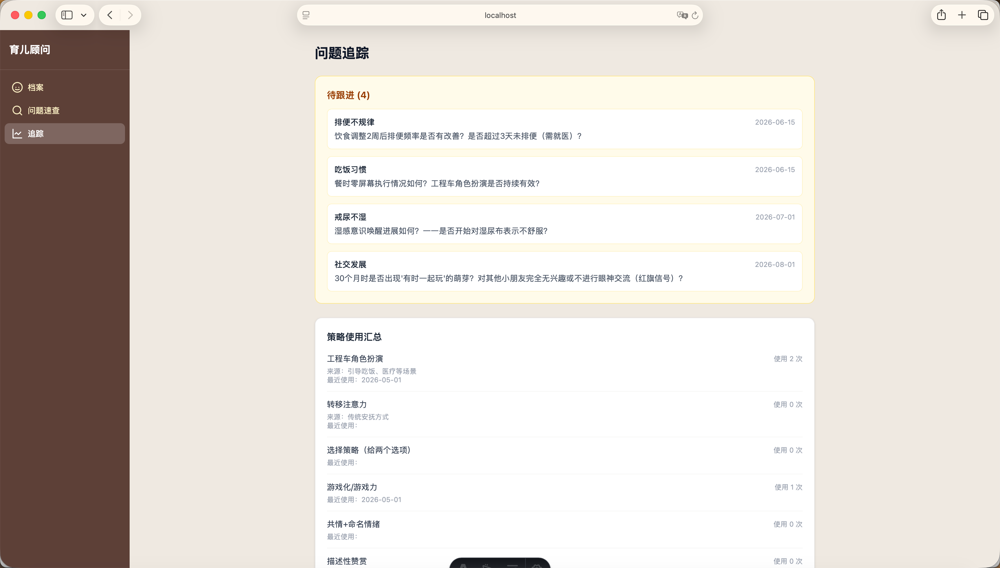
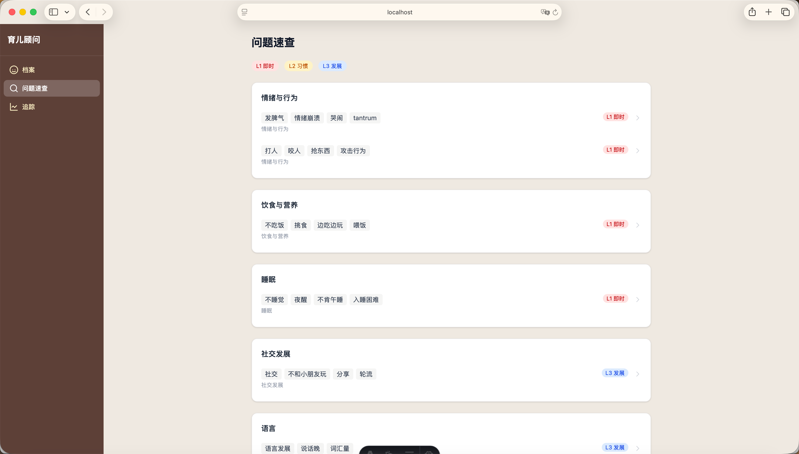
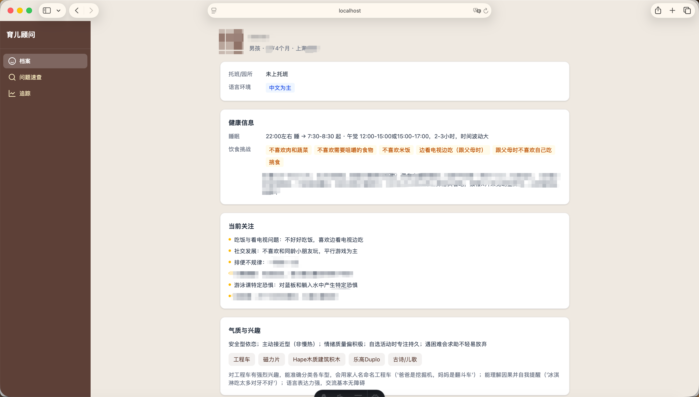

# 育儿顾问 Skill

AI 驱动的个性化育儿指导系统。通过对话了解你的孩子，建立专属档案，提供循证、个性化的育儿建议。

基于 [Claude Code](https://claude.ai/code) Skill 构建，开箱即用。

### 界面预览

<p align="center">



</p>

## 特点

### 自我进化系统

不是一次性的问答工具，而是一个会持续成长的育儿助手：

- **策略效果追踪** — 每条建议自动记录执行效果，有效策略优先推荐，无效策略自动降权
- **上下文感知** — 记录近期事件（生病、旅行等）、活跃问题、季节因素，建议具有连续性
- **对话中学习** — 每次对话自动提炼孩子的新观察（行为模式、发展变化、偏好），经你确认后写入档案

### 问题分层处理

根据问题性质采用不同的处理方式，不是所有问题都给同样的建议：

| 层级 | 典型场景 | 处理方式 |
|------|---------|---------|
| L1 即时问题 | 孩子正在哭闹、不肯吃饭、又发脾气了 | 快速响应，2-3 个立即可执行步骤 |
| L2 习惯养成 | 戒奶嘴、如厕训练、自己吃饭、屏幕时间管理 | 制定阶段性计划，自动追踪进度 |
| L3 发展观察 | 语言发展、社交能力、发育是否正常 | 提供观察指标，建议月度回顾 |

### 自动触发调研

当遇到以下情况时，系统会自动上网调研，补充知识库：

| 触发条件 | 说明 |
|---------|------|
| 问题不在知识库中 | 你提出的育儿问题超出现有覆盖范围 |
| 策略连续无效 | 追踪记录显示某个策略对你的孩子反复不生效 |
| 医学内容超过 12 个月 | 健康类信息可能已过时，需要复核 |
| 策略适用月龄不匹配 | 孩子长大了，某些策略已不适合当前阶段 |

调研获得的新知识自动写入 `data/research/` 目录并更新索引，下次遇到同类问题直接引用。

### 深度引用，不断章取义

引用某本书的策略时，系统会先回读原著完整论述，理解适用边界和作者本意，再结合你孩子的具体情况给出建议。不是简单地从书里摘一句话。

### 家长状态感知

从你的对话中识别情绪信号，自动调整回复策略：

- 反复问同类问题 → 建议可能太复杂了，简化为核心一步
- 提到情绪失控/吼孩子 → 先共情，再给一个最简单的技巧
- 回复很简短 → 你可能比较忙，回复更简洁
- 主动分享进步 → 信心增强了，可以建议更有挑战的策略

## 使用方法

### 前提条件

- [Claude Code](https://claude.ai/code) 已安装（参考[官方文档](https://docs.anthropic.com/en/docs/claude-code)）
- Node.js 18+（Web 可视化页面需要）

### 快速开始

```bash
# 1. Clone 项目
git clone https://github.com/Ethanzyc/yuer-skill.git
cd yuer-skill

# 2. （可选）安装 Web 可视化页面依赖
cd web && npm install && cd ..

# 3. 在项目目录下启动 Claude Code
claude
```

### 两个命令

| 命令 | 用途 | 示例 |
|------|------|------|
| `/yuer` | 日常指导：活动推荐 + 发展关注 + 跟进回访 | 直接输入 `/yuer` |
| `/yuer-ask` | 问题解答：循证建议 + 效果追踪 | `/yuer-ask 孩子不肯自己吃饭怎么办` |

### 首次使用

第一次输入 `/yuer` 或 `/yuer-ask` 时，系统会进入建档模式，像聊天一样了解你的孩子：

1. 先问基本信息（名字、出生日期）和你最关心的 2-3 个问题
2. 后续对话中自然展开：健康状况、气质特点、家庭环境
3. 收集到基本信息后立即开始回答问题，其余在对话中逐步补充

不需要手动填写任何文件。

### 可视化页面（可选）

```bash
cd web && npm run dev
```

浏览器访问 `http://localhost:4321`，查看孩子档案、问题速查、建议追踪。

## 知识库

### 内置知识库（knowledge/）

随项目更新，覆盖 2-3 岁育儿常见场景的循证资料：

| 文件 | 主题 |
|------|------|
| 01-parenting-books-guide.md | 6 本经典育儿书精读笔记 |
| 03-problem-navigation.md | 育儿问题导航手册（情绪、行为、沟通、安全感等） |
| 05-play-activities-design.md | 2-3 岁游戏活动设计方案 |
| 06-screen-time-evidence.md | 屏幕时间循证指南 |
| 07-developmental-milestones-26-36m.md | 26-36 月龄发育里程碑参考 |
| 08-nutrition-health-guide.md | 营养健康指南 |
| 09-pacifier-weaning-guide.md | 戒奶嘴专题指南 |
| 10-toilet-training-guide.md | 如厕训练专题指南 |
| 11-fear-desensitization-guide.md | 恐惧脱敏专题指南 |
| 12-playful-parenting-deep-dive.md | 《游戏力》深度解读 |
| 13-discipline-approaches-comparison.md | 管教方法横向比较 |
| 14-no-drama-discipline-and-how-to-talk-deep-dive.md | 《去情绪化管教》+《如何说》深度解读 |
| 15-strategy-deep-context.md | 策略深度上下文 |

引用的 6 本核心育儿书：

| 书名 | 核心方法 | 适用年龄 |
|------|---------|---------|
| Good Inside（看见孩子） | 行为是冰山一角，看见行为背后的需求 | 0-6 岁 |
| 1-2-3 Magic（魔法 1-2-3） | 温和而坚定的计数管教法 | 2-12 岁 |
| No Bad Kids（没有坏孩子） | 尊重式管教，接纳情绪 + 坚定边界 | 0-3 岁 |
| 游戏力（Playful Parenting） | 通过游戏建立连接、化解冲突 | 1-8 岁 |
| 去情绪化管教（No-Drama Discipline） | 全脑教养，先连接再引导 | 0-6 岁 |
| 如何说孩子才会听 | 共情沟通技巧，代替命令和指责 | 2-12 岁 |

### 用户知识库（data/research/）

你积累的知识自动存放在这里：

- AI 调研获得的新知识 → 自动写入 `data/research/`
- 你手动添加的读书笔记 → 放入 `data/research/`，更新 `data/knowledge-index.json`

知识库是纯 Markdown/JSON，无需编程，用任何文本编辑器都能维护。

## 数据存储

所有用户数据存储在本地 `data/` 目录下（已加入 `.gitignore`，不会上传到 GitHub）：

| 文件 | 内容 | 生成方式 |
|------|------|---------|
| `data/child-profile.json` | 孩子档案（基本信息、发展、气质、家庭） | 对话中自动收集 |
| `data/advice-tracking.json` | 建议追踪（策略效果、历史记录、待跟进） | 给建议时自动记录 |
| `data/context-journal.json` | 上下文日志（近期事件、活跃问题） | 对话中自动更新 |
| `data/knowledge-index.json` | 用户积累的知识索引 | 调研时自动更新 |
| `data/research/` | 用户积累的知识文章 | 调研时自动创建 |

### 数据自动维护

- 近期事件超过 90 天自动标记为可清理
- 活跃问题不超过 5 条，已解决的及时移除
- 建议记录超过 100 条时自动归档旧记录

## 关于不同模型的效果差异

本项目基于 Claude Code Skill 机制构建，不同底层模型的能力和风格会影响使用体验。即使都在 Claude Code 中运行，不同模型版本在复杂上下文处理、策略追踪等环节的表现也可能不同。

如果遇到 AI 回复不符合预期的情况，可以尝试：
- 重新描述你的问题，给出更多上下文
- 直接让 AI 读取相关文件后重新回答
- 在本项目中手动修正数据文件

## 反馈与联系

- **Bug / 问题**：[提交 Issue](https://github.com/Ethanzyc/yuer-skill/issues)
- **功能建议**：同样通过 Issue 提出，欢迎描述你想要的功能场景
- **微信交流**：ADJITLH（备注"育儿 Skill"）

## 目录结构

```
├── .claude/
│   └── skills/parenting/
│       ├── SKILL.md                 # Skill 核心逻辑
│       └── data-schemas.md          # JSON 数据结构参考
├── knowledge/                        # 内置知识库（随 skill 更新）
│   ├── index.json                    # 内置知识索引
│   └── *.md                          # 13 个预置调研文档
├── data/                             # 用户数据（gitignore）
│   ├── child-profile.json            # 孩子档案
│   ├── advice-tracking.json          # 建议追踪
│   ├── context-journal.json          # 上下文日志
│   ├── knowledge-index.json          # 用户知识索引
│   └── research/                     # 用户积累的知识文章
├── web/                              # Astro 可视化页面
│   └── src/pages/                    # 档案/问题速查/追踪页面
└── README.md
```

## 技术栈

- **Skill**：Claude Code Custom Skill
- **数据**：JSON（AI 自动读写，结构规范见 `data-schemas.md`）
- **知识库**：Markdown
- **Web**：Astro 5 + Tailwind CSS v4（纯静态，无 SSR）

## License

MIT
