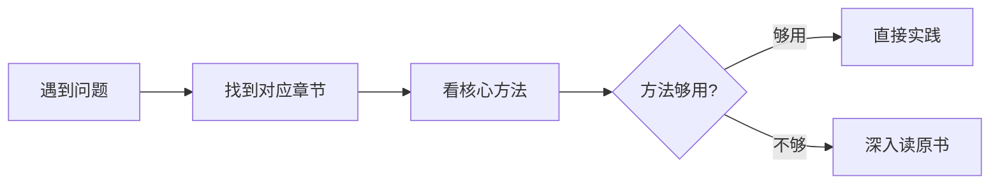
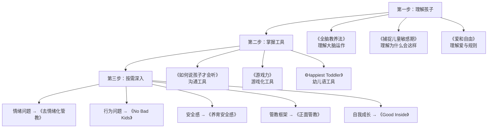

# 育儿问题导航手册

> 遇到问题 → 翻到对应章节 → 快速了解核心方法 → 决定是否深入读原书
> 调研日期：2026-04-30
> 详细书籍摘要见：[02-parenting-books-deep-dive.md](02-parenting-books-deep-dive.md)

---

## 使用说明

---

## 一、情绪类问题

### 1.1 孩子突然情绪崩溃 / 大发脾气

**首选**：《全脑教养法》策略1-2 + 《Happiest Toddler》幼儿语

**核心方法**：

| 步骤 | 方法 | 来源 |
|------|------|------|
| 1 | **不要讲道理**，先用右脑连接（拥抱、共情） | 全脑教养法 #1 |
| 2 | **帮孩子命名情绪**："你很生气，因为想继续玩对吗？" | 全脑教养法 #2 |
| 3 | **用"幼儿语"重复孩子的感受**："不！不！不！你想玩！" | Happiest Toddler |
| 4 | 等情绪平复后，再简单说明规则 | 全脑教养法 #1 |
| 5 | 如果仍无法平复，**让孩子动起来**（走一走、跳一跳） | 全脑教养法 #5 |

**一句话要点**：情绪崩溃时孩子的大脑是"下脑"主导，此时说教无效，先共情再引导。

**深入阅读**：《全脑教养法》P20-80、《Happiest Toddler》P85-140

---

### 1.2 孩子打人 / 咬人 / 扔东西

**首选**：《No Bad Kids》+ 《去情绪化管教》

**核心方法**：

| 步骤 | 方法 | 来源 |
|------|------|------|
| 1 | **平静地制止**：握住孩子的手，"我不会让你打人" | No Bad Kids |
| 2 | **接纳情绪 + 限制行为**："你很生气，但打人是不允许的" | No Bad Kids |
| 3 | **蹲下来平视**，简短有力地表达边界 | 去情绪化管教 |
| 4 | **不要长篇说教**——幼儿无法处理复杂解释 | No Bad Kids |
| 5 | 事后（情绪平静后）引导替代行为："下次生气时你可以跺脚" | 去情绪化管教 |

**一句话要点**：情绪被接纳 ≠ 行为被允许。平静、坚定、简短。

**深入阅读**：《No Bad Kids》全书（薄书，快速读完）、《去情绪化管教》P100-160

---

### 1.3 孩子经常说"不" / 什么都拒绝

**首选**：《捕捉儿童敏感期》— 自我意识敏感期

**核心理解**：

> 这不是叛逆，而是自我意识在建构。2-3岁孩子通过说"不"来确立"我"的存在。

**应对方法**：

| 做法 | 说明 |
|------|------|
| **给有限选择** | "穿红色还是蓝色？"（无论选哪个都在穿衣服）|
| **避免正面冲突** | 不说"你必须..."，改用"你想...还是..." |
| **尊重合理拒绝** | 在安全范围内允许孩子说"不" |
| **不贴标签** | 不说"你这孩子怎么这么犟" |

**深入阅读**：《捕捉儿童敏感期》自我意识敏感期章节

---

### 1.4 孩子因秩序被打乱而哭闹（如饼干碎了、换了路线）

**首选**：《捕捉儿童敏感期》— 秩序敏感期 + 执拗敏感期

**核心理解**：

> 2-3岁孩子对秩序有近乎"偏执"的需求，这是大脑建构内在秩序感的过程，不是"矫情"。

**应对方法**：

- 尽量维持生活环境和作息的稳定
- 秩序被打破时，**理解而非指责**
- 不说"有什么好哭的"，而是"我知道你想要完整的饼干"
- 无法满足时，陪伴等待情绪过去，不急于转移注意力

**深入阅读**：《捕捉儿童敏感期》秩序敏感期 + 执拗敏感期章节

---

## 二、行为类问题

### 2.1 孩子不肯配合日常事务（穿衣、吃饭、洗澡、出门）

**首选**：《游戏力》+ 《Happiest Toddler》

**核心方法**：

| 策略 | 举例 |
|------|------|
| **把任务变成游戏** | 衣服追人游戏、"衣服在找你呢，快让它找到你！" |
| **角色反转** | "你来帮妈妈穿衣服好不好？" |
| **给选择** | "先穿袜子还是先穿上衣？" |
| **比赛/挑战** | "我猜你3个数穿不完——1、2..." |
| **夸张戏剧化** | 用搞笑的声音、表情吸引注意力 |

**一句话要点**：2-3岁的孩子不接受"命令"，但接受"游戏"。

**深入阅读**：《游戏力》P50-120、《Happiest Toddler》P165-200

---

### 2.2 孩子反复试探底线 / 故意做不允许的事

**首选**：《正面管教》+ 《No Bad Kids》

**核心方法**：

| 方法 | 说明 | 来源 |
|------|------|------|
| **和善而坚定** | 语气温柔但规则不变，不因哭闹而退让 | 正面管教 |
| **自然后果** | 安全范围内让孩子体验行为结果 | 正面管教 |
| **行动代替言语** | 不反复说"不要"，而是平静地移走危险物品 | No Bad Kids |
| **创造"YES"环境** | 做好安全防护，减少"不可以"的频率 | No Bad Kids |
| **一致性** | 今天不允许的事明天也不允许 | 正面管教 |

**深入阅读**：《正面管教》P60-110、《No Bad Kids》P30-70

---

### 2.3 孩子在公共场合大哭大闹

**首选**：《Happiest Toddler》+ 《No Bad Kids》

**核心方法**：

1. 先处理自己的情绪（深呼吸）
2. 蹲下来平视，用"幼儿语"共情："你想玩！你——想——继续——玩！"
3. 简短确认规则："但是我们要回家了。"
4. 如果持续哭闹，**抱到安静的地方**陪伴等待
5. 不在公共场合训斥、不威胁"再哭我不要你了"

**深入阅读**：《Happiest Toddler》P85-140

---

## 三、沟通类问题

### 3.1 说了无数遍孩子不听

**首选**：《如何说孩子才会听》

**核心方法**：

| 技巧 | 错误示范 | 正确示范 |
|------|---------|---------|
| **描述事实** | "你怎么又不收玩具！" | "地上还有好多玩具" |
| **给提示** | "跟你说多少遍了！" | "玩具应该放在箱子里" |
| **一个词** | 长篇大论 | "玩具！" |
| **说感受** | "你气死我了" | "看到地上乱糟糟的我很烦躁" |
| **写便条** | — | 在玩具箱上贴"送我回家" |

**一句话要点**：用描述代替指责，用提示代替命令。

**深入阅读**：《如何说孩子才会听》技巧一至三

---

### 3.2 不知怎么夸孩子（总觉得"你真棒"太空）

**首选**：《如何说孩子才会听》技巧五

**核心方法**：**描述性赞赏**

| 错误 | 正确 |
|------|------|
| "你真聪明！" | "我看到你自己把拼图完成了，先试了这边，又试了那边" |
| "你太棒了！" | "你把积木都收进了箱子里，走进干净的房间我觉得好舒服" |
| "乖孩子" | "这就是'有耐心'" |

**一句话要点**：描述你看到的 + 描述你的感受 + 用一个词总结。

---

### 3.3 孩子不肯表达 / 问不出发生了什么

**首选**：《游戏力》角色反转 + 《全脑教养法》记忆遥控器

**核心方法**：

- 让孩子用**画画或角色扮演**表达（比语言更容易）
- 睡前用"今天最开心/最难的事情"开启对话（全脑教养法 #7）
- 不要追问"你怎么了"，而是**先陪伴，等孩子主动说**

---

## 四、安全感类问题

### 4.1 分离焦虑 / 粘人

**首选**：《养育有安全感的孩子》+ 《Good Inside》

**核心方法**：

| 方法 | 说明 |
|------|------|
| **安全圈上半** | 鼓励孩子探索，传递"你可以"的信心 |
| **安全圈下半** | 孩子回来时热情迎接，传递"我在这"的安全感 |
| **简短告别** | 不偷偷溜走，不反复告别。简短说"妈妈下午来接你"，然后坚定离开 |
| **修复分离** | 重逢后第一时间全然陪伴，"蓄满爱之杯"（游戏力） |

**深入阅读**：《养育有安全感的孩子》P40-90

---

### 4.2 孩子胆小 / 害怕

**首选**：《游戏力》+ 《全脑教养法》

**核心方法**：

- **不要说"有什么好怕的"**——恐惧是真实的
- 用游戏角色反转：让孩子扮演"打败怪兽"的角色（游戏力）
- **记忆遥控器**：让孩子按自己的节奏回忆和面对恐惧经历（全脑教养法 #6）
- 逐步暴露：先在安全距离观察，慢慢靠近

---

### 4.3 吼完孩子后悔 / 亲子关系裂痕

**首选**：《Good Inside》修复对话 + 《养育有安全感的孩子》

**核心修复步骤**：

1. 自己先冷静
2. 主动找孩子："刚才妈妈/爸爸大声说话了，对不起"
3. 简单解释（不甩锅）："我刚才太着急了，不应该那样说话"
4. 重新连接：拥抱、一起读本书、玩个游戏
5. 向孩子示范：关系裂痕可以被修复

**一句话要点**：不需要完美父母，修复本身就在建立安全感。

---

## 五、发展类问题

### 5.1 如何促进2-3岁语言发展

**首选**：《捕捉儿童敏感期》语言敏感期

**核心方法**：

- 多与孩子**对话**（不是单向指令）
- **回应提问**，即使重复了100遍"这是什么"
- 每天**亲子共读**绘本
- **不纠正**发音和语法，用正确的说法自然重复
- 给物品**命名**，丰富词汇环境

---

### 5.2 如何支持2-3岁大运动/精细动作发展

**首选**：《蒙台梭利家庭方案：0～3岁》

| 领域 | 活动 |
|------|------|
| 精细动作 | 倒水、用夹子、串珠、撕纸、涂鸦 |
| 手眼协调 | 拼图、搭积木、嵌套杯 |
| 大运动 | 跑、跳、上下楼梯、踢球、平衡木 |
| 日常生活 | 自己穿脱、洗手、擦桌子、择菜 |

---

### 5.3 如厕训练

**首选**：《正面管教：0-3岁》

**核心原则**：

- 18-36个月是黄金窗口
- **等孩子准备好**（能表达尿意、对马桶感兴趣、尿布干的时间变长）
- 不强迫、不惩罚意外
- 把如厕变成**游戏和仪式**，而非任务
- 准备儿童马桶、穿训练裤

---

## 六、日常习惯

### 6.1 吃饭问题（挑食/不肯自己吃）

**推荐组合**：《正面管教》自然后果 + 《游戏力》

- 不追喂、不威胁（"不吃就不给你看动画片"）
- 让孩子参与**食物准备**（洗菜、摆盘）
- "你决定吃多少，我决定吃什么"
- 用游戏化方式："西兰花是小树，你是恐龙来吃小树！"

### 6.2 睡眠问题（不肯睡/夜醒）

**推荐组合**：《Happiest Toddler》+ 《正面管教》

- 建立**固定的睡前仪式**（洗澡→绘本→关灯，顺序不变）
- 睡前30分钟**无屏幕**
- 用"幼儿语"共情抗拒："你想继续玩！但是...睡觉时间到了。"
- 仪式中给孩子**选择权**（"今天读哪本绘本？"）

### 6.3 屏幕时间管理

**推荐组合**：《简单父母经》+ 《正面管教》

- 2岁前尽量无屏幕；2-3岁每天不超过30分钟
- **提前预告**关电视时间（"还有5分钟"）
- 用"幼儿语"共情抗拒："你想继续看！但时间到了。"
- 用游戏替代屏幕（准备"活动菜单"作为替代）

---

## 七、父母自身成长

### 7.1 管教时控制不住自己情绪

**首选**：《Good Inside》+ 《去情绪化管教》

- 识别自己的**情绪触发点**（"鲨鱼音乐"）
- **先暂停自己**："妈妈需要冷静一分钟"
- 理解：你不需要完美，修复比不犯错更重要
- 长期：反思自己的童年经历如何影响当前养育

### 7.2 不确定自己的育儿方式对不对

**首选**：《爱和自由》+ 《园丁与木匠》

- 重新审视"听话"这个标准
- 理解"爱 + 自由 + 规则"的平衡
- 从"木匠"（按图纸打造孩子）转向"园丁"（提供土壤，让孩子自然生长）

---

## 八、26个月男孩场景速查

> 基于当前年龄最可能遇到的问题

| 场景 | 最该翻的章节 |
|------|-------------|
| 洗澡不肯出来 | 二.1 游戏力 |
| 穿衣服大战 | 二.1 游戏力 + Happiest Toddler |
| 饭桌上扔食物 | 一.2 No Bad Kids |
| 突然打人/咬人 | 一.2 No Bad Kids |
| 说"不要不要不要" | 一.3 捕捉敏感期 |
| 碎了饼干大哭 | 一.4 捕捉敏感期 |
| 出门不肯走 | 一.1 全脑教养法 + 二.1 Happiest Toddler |
| 超市里躺地上 | 二.3 Happiest Toddler |
| 抢别人玩具 | 一.2 + 二.2 正面管教 |
| 不要妈妈去上班 | 四.1 养育安全感 |
| 说了三遍还不收玩具 | 三.1 如何说 |
| 晚上不肯睡 | 六.2 睡眠 |
| 自己发脾气吼了孩子 | 七.1 Good Inside |

---

## 九、书籍阅读路线图

