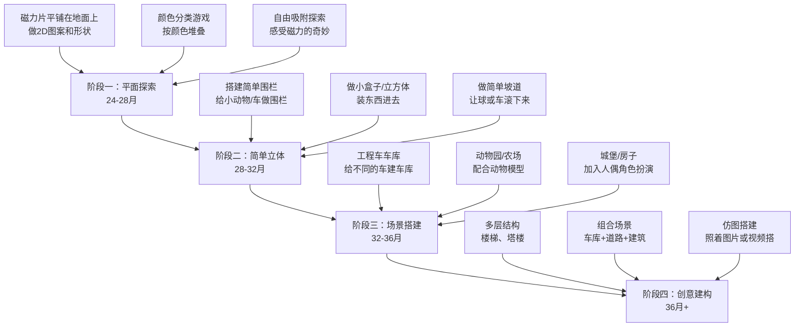

# 2-3岁幼儿游戏活动设计方案

> 创建日期：2026-05-01
> 适用对象：2-3岁幼儿
> 活动空间：约10平米独立游戏房间 + 小区/公园户外
> 核心兴趣：工程车（挖掘机、翻斗车等）、磁力片（可替换为孩子的核心兴趣）

---

## 一、按发展领域分类的活动建议

### 1.1 大运动活动

2-3岁幼儿大运动正处于快速发展期，跑跳能力逐步提升，但上下楼梯和踢球等技能可能需要更多练习。大运动活动的重点应放在**多样化运动体验**上，避免单一重复。

| 活动名称 | 目标领域 | 适合月龄 | 场地 | 玩法说明 |
|----------|---------|---------|------|---------|
| 小兔子运货 | 下肢力量、双脚跳 | 24-36月 | 室内 | 在房间一端放"货物"（积木/球），另一端放"仓库"（纸箱），模仿兔子跳着运送。可结合工程车角色："挖掘机要运石头啦！" |
| 纸箱隧道探险 | 爬行协调、空间感知 | 24-30月 | 室内 | 用大纸箱拼接成隧道，让孩子爬过去。可以在隧道里放小工程车，"把挖掘机开出隧道！" |
| 踩石头过河 | 平衡感、跨步 | 26-36月 | 室内/户外 | 在地上摆放靠垫或泡沫垫作为"石头"，孩子踩着过"河"。逐渐加大间距增加难度 |
| 踢球进门大赛 | 下肢协调、瞄准 | 30-36月 | 户外 | 用两个矿泉水瓶做球门，鼓励用脚踢软球进门。可以逐步后退增加距离 |
| 模仿动物走 | 全身协调、核心力量 | 24-36月 | 室内 | 模仿螃蟹横走、熊爬、青蛙跳、大象走。家长和孩子轮流当"领队" |
| 抛球入筐 | 上肢力量、手眼协调 | 26-36月 | 室内 | 用洗衣筐做目标，让孩子站在不同距离把球/沙包投进去。可设定分数增加趣味 |
| 上下楼梯计数 | 腿部力量、数字感知 | 24-36月 | 楼道 | 每上一级台阶数一个数，培养节奏感。用"和挖掘机一起爬坡"的故事增加趣味 |
| 气球排球 | 手眼协调、反应力 | 26-36月 | 室内 | 吹一个气球，和孩子一起用手/头把气球保持在空中不落地 |

### 1.2 精细动作活动

2-3岁幼儿精细动作正处于从抓握向精准操作过渡的阶段，能用勺子、会涂鸦，但拼图和串珠等技能可能需要引导。需要从高兴趣活动切入，逐步拓展。

| 活动名称 | 目标领域 | 适合月龄 | 玩法说明 |
|----------|---------|---------|---------|
| 工程车运豆子 | 三指捏、转移能力 | 24-30月 | 用勺子或夹子把黄豆/红豆从一个碗"运"到翻斗车的车厢里。翻斗车是核心兴趣点，容易激发参与 |
| 橡皮泥工程队 | 揉捏搓压、手指力量 | 24-36月 | 用橡皮泥做"工地"：搓圆球做石头、压扁做路面、搓长条做栏杆。工程车可以在橡皮泥路面上压出"轮胎印" |
| 贴纸画创作 | 撕贴、手指灵活度 | 24-36月 | 提供工程车主题贴纸，让孩子贴在大纸上。可先撕再贴，锻炼拇指食指协调 |
| 倒水加油站 | 手腕控制、双侧协调 | 26-36月 | 用小水壶往矿泉水瓶里倒水，假装"给工程车加油"。先用大口容器，逐渐换成小口瓶 |
| 纸张撕贴画 | 撕、贴、手指力量 | 24-30月 | 把彩纸撕成小碎片，粘贴成工程车或简单图形。适合入门级精细动作练习 |
| 大珠串项链 | 手眼协调、穿线 | 26-36月 | 用大孔木珠（直径2cm+）和粗鞋带串珠。初期家长固定珠子，孩子穿线；后期独立完成 |
| 剪纸初体验 | 剪切动作、手部控制 | 30-36月 | 用安全剪刀剪橡皮泥条（比剪纸更易成功），建立信心后再剪厚纸条。不急于用纸 |
| 夹夹子游戏 | 手指捏力、开合动作 | 26-36月 | 把晾衣夹夹在纸板边缘或纸盘上，"给小怪物装牙齿"。用彩色夹子增加视觉趣味 |

### 1.3 语言发展活动

2-3岁幼儿语言发展正处于词汇爆发期，词汇量快速增长，开始尝试简单句和短歌谣。重点在于**延伸表达深度**和**保持双语环境**（如适用）。

| 活动名称 | 目标领域 | 适合月龄 | 玩法说明 |
|----------|---------|---------|---------|
| 工程车故事接龙 | 叙事能力、想象力 | 26-36月 | 家长说一句话，孩子接一句："挖掘机今天去工地……" "它挖了一个大坑！" "大坑里有什么？" 鼓励孩子发挥想象 |
| 绘本角色扮演 | 理解与表达、词汇拓展 | 24-36月 | 读工程车/交通工具绘本后，用玩具重现故事。推荐《晚安，工地上的车》《挖掘机来了》等 |
| 儿歌动作配合 | 听觉理解、节奏感 | 24-36月 | 选择有动作指令的儿歌（如《头肩膀膝盖脚》《如果开心你就拍拍手》），边唱边做动作。适合喜欢音乐的孩子 |
| 看图说话 | 观察力、描述性语言 | 26-36月 | 翻看绘本时，不只读文字，而是问："挖掘机在干什么？" "翻斗车里装了什么？" 引导孩子用自己的话描述 |
| 猜猜我是谁 | 推理表达、特征描述 | 30-36月 | 家长描述一种工程车的特征："它有大大的铲子，能挖土，是什么车？" 让孩子猜，然后交换角色 |
| 双语词汇配对 | 英语启蒙、词汇对照 | 26-36月 | 利用孩子已有的兴趣主题英语词汇基础，扩展相关词汇（如工程车主题：rock, dirt, road, build, dig）。用闪卡或实物配对游戏 |
| 电话游戏 | 对话轮流、社交语言 | 26-36月 | 用玩具电话或积木块当电话，"喂，挖掘机师傅吗？工地需要你！" 练习对话中的问答轮流 |

### 1.4 认知发展活动

2-3岁幼儿认识基本颜色和部分形状，能1-10唱数但点数能力可能尚未完全建立。认知活动应**结合孩子的核心兴趣**，从具体到抽象。

| 活动名称 | 目标领域 | 适合月龄 | 玩法说明 |
|----------|---------|---------|---------|
| 工程车颜色分类 | 颜色分类、归类思维 | 24-30月 | 准备不同颜色的工程车，用对应颜色的纸做"停车场"，让孩子把车停到对应颜色的停车场 |
| 点数工程车 | 一一对应、点数能力 | 26-36月 | 摆出2-5辆工程车，用手逐个指着数："1、2、3，一共3辆挖掘机！" 反复示范点数动作，从唱数过渡到真正的点数 |
| 形状工地 | 形状认知、空间感知 | 26-36月 | 用磁力片搭建三角形屋顶、正方形房子，边搭边命名形状。问孩子："这个房顶是什么形状？" |
| 大小排序 | 比较概念、序列思维 | 30-36月 | 准备3辆大小不同的工程车，按从小到大排成一排："最小的是谁？最大的是谁？" |
| 影子配对 | 观察力、形状匹配 | 26-36月 | 在阳光下或灯光下给工程车照影子，让孩子把车和影子配对。也可用纸画出车的轮廓做配对 |
| 积木仿搭 | 空间推理、视觉记忆 | 26-36月 | 家长用3-4块积木搭一个造型，让孩子照着搭一样的。从简单到复杂递进 |
| 天气认知 | 自然认知、日常概念 | 24-36月 | 每天早上看窗外，问"今天天气怎么样？" 配合天气卡片（晴天、下雨、多云）让孩子选 |

### 1.5 社交情绪活动

2-3岁幼儿当前以平行游戏为主，不太主动与同伴互动，这是正常发展阶段。重点是**创造安全的社交环境**和**建立情绪认知**。

| 活动名称 | 目标领域 | 适合月龄 | 玩法说明 |
|----------|---------|---------|---------|
| 工程队角色扮演 | 合作意识、角色理解 | 26-36月 | 家长和孩子各拿一辆工程车，合作完成"任务"："你用挖掘机挖土，我用翻斗车运走。" 建立简单的合作概念 |
| 情绪脸谱 | 情绪识别、表达 | 24-36月 | 准备开心、难过、生气、害怕的表情卡片，家长做表情让孩子配对；再问"什么时候你会开心/难过？" |
| 工程车分享会 | 分享意识、社交练习 | 30-36月 | 有小朋友来家里时，准备双份工程车，自然地引导"你一辆，他一辆"。不强制分享，而是营造分享的自然场景 |
| 小小老师 | 自信心、表达力 | 30-36月 | 让孩子"教"家长玩自己最擅长的玩具："挖掘机怎么挖土的？你教教我。" 反转角色增强自信 |
| 轮流游戏 | 等待、规则意识 | 26-36月 | 玩需要轮流的游戏：轮流搭磁力片、轮流推工程车。用"该你了/该我了"的语言强化轮流概念 |
| 情绪故事 | 情绪理解、共情萌芽 | 30-36月 | 编简单的故事："小挖掘机今天很伤心，因为它的铲子坏了。你难过的时候会怎么办？" 引导孩子认识和理解情绪 |

---

## 二、工程车主题活动

以下是围绕常见核心兴趣点——工程车——设计的跨领域主题活动。每个活动都标注了覆盖的发展领域。可根据孩子的实际兴趣替换主题。

### 2.1 工程车感官游戏（沙/泥/水）

> **安全提示**：沙子和泥土活动建议在阳台或铺设防污垫的地面进行。用食用色素代替不可食用颜料。小零件（石子）需家长全程看护。

| 活动名称 | 发展领域 | 适合月龄 | 材料准备 | 玩法说明 |
|----------|---------|---------|---------|---------|
| 动力沙工地 | 感官统合、精细动作 | 24-36月 | 动力沙（kinetic sand）、小型工程车模型、小铲子 | 在大烤盘或塑料盆里铺动力沙，用挖掘机挖、翻斗车运、推土机推。可以埋小石子让孩子"挖掘发现" |
| 水盆工地 | 感官探索、因果关系 | 24-30月 | 大水盆、塑料工程车、小杯子、漏斗 | 工程车在水盆里"工作"，用杯子倒水。观察什么会沉、什么会浮。"挖掘机能浮起来吗？" |
| 泥巴工程建设 | 感官探索、创造力 | 26-36月 | 食用色素+面粉+水调成的"安全泥巴"，工程车，树叶小石头 | 在阳台或户外用安全泥巴做工地，挖掘机挖泥巴、翻斗车运泥巴。让孩子自由探索泥巴的触感 |
| 米粒工地 | 感官体验、精细动作 | 24-30月 | 大盆装满大米、工程车模型、小碗、漏斗、勺子 | 工程车在大米里行驶，用勺子装米到翻斗车里。大米比沙子干净，适合室内 |
| 工程车洗车场 | 感官体验、生活技能 | 26-36月 | 两盆水（一盆加洗洁精泡泡）、海绵/刷子、工程车 | 先在沙/泥里玩脏车，然后"开"到洗车场清洗。用海绵擦洗，练习清洁动作 |

### 2.2 工程车角色扮演

| 活动名称 | 发展领域 | 适合月龄 | 玩法说明 |
|----------|---------|---------|---------|
| 建筑工地情境 | 社交想象、语言表达 | 26-36月 | 用磁力片搭"建筑"、用积木做"砖块"，工程车来搬运。家长扮演"工长"发指令："挖掘机，请把这堆石头运走！" 让孩子执行任务 |
| 交通指挥员 | 规则意识、语言指令 | 30-36月 | 用纸板做红绿灯，工程车按信号行驶。家长和孩子轮流当交警和司机。"红灯停！绿灯行！" |
| 道路建设队 | 想象力、叙事能力 | 26-36月 | 用胶带在地板上贴出"道路"，工程车沿路行驶。在路上设置"加油站""修理厂""工地"等站点，编故事 |
| 工程车看病 | 角色扮演、共情培养 | 30-36月 | 工程车"坏了"需要修理，用玩具工具箱修车。延展到角色互换，让孩子当"医生"照顾生病的小车 |
| 装卸货运输 | 数学概念、精细动作 | 26-36月 | 用不同颜色的小积木/小球当"货物"，按颜色分装到不同的翻斗车里。到达目的地后卸货、分类堆放 |

### 2.3 工程车数学启蒙

| 活动名称 | 数学概念 | 适合月龄 | 玩法说明 |
|----------|---------|---------|---------|
| 数一数几辆车 | 点数、一一对应 | 26-36月 | 摆出1-5辆工程车，手口一致地点数。重点练习从**唱数过渡到点数**的能力 |
| 颜色停车场 | 分类、归类 | 24-30月 | 准备红、黄、蓝三色纸做停车场，把对应颜色的工程车停进去。"红色挖掘机停在红停车场" |
| 大中小排排队 | 比较大小、排序 | 30-36月 | 准备3辆不同大小的工程车，让孩子按从小到大排列。加入"最大""最小"的词汇 |
| 装货比多少 | 比较多少、数量 | 30-36月 | 两辆翻斗车各装不同数量的积木块，"哪辆车装得多？" 直观感受"多"和"少" |
| 形状工地 | 形状认知 | 26-36月 | 用三角形、正方形、长方形的磁力片做工地标志牌，边搭边说形状名称。"三角形是警告标志！" |
| 工程车编号 | 数字识别 | 30-36月 | 在工程车上贴数字1-5，让孩子按编号顺序排列工程车队。也可练习"找到3号车" |

### 2.4 工程车精细动作活动

| 活动名称 | 动作目标 | 适合月龄 | 玩法说明 |
|----------|---------|---------|---------|
| 轮胎印画 | 手腕控制、按压 | 24-30月 | 工程车轮子蘸可水洗颜料，在大纸上滚动留下轨迹。不同车留下不同花纹 |
| 工程车拼装 | 拧转、插拔 | 30-36月 | 使用可拆装的工程车玩具（如大号螺丝+螺母款），练习拧、拔、插等动作 |
| 工地标志牌 | 涂鸦、握笔 | 26-36月 | 用粗蜡笔在硬纸板上画工地标志（三角形、圆形），然后"插"在工地旁边 |
| 工程车轨道拼图 | 拼接、对准 | 30-36月 | 用木制轨道片拼接道路，让工程车在上面行驶。需要精确对准和连接，锻炼手眼协调 |

---

## 三、磁力片进阶玩法

### 3.1 磁力片发展阶段（2-3岁）

如果孩子已有磁力片玩耍经验，以下是从当前阶段开始的递进路线。



### 3.2 各阶段详细玩法

#### 阶段一：平面探索（24-28个月）-- 当前阶段

| 玩法 | 说明 | 技能点 |
|------|------|--------|
| 地面平铺图案 | 在地板上用磁力片拼大三角形、正方形、长方形 | 形状认知、空间感 |
| 颜色分类堆叠 | 把相同颜色的磁力片堆在一起，做"颜色塔" | 颜色认知、分类 |
| 自由吸附 | 随意把磁力片吸在一起，感受磁力吸附和排斥 | 感官探索、因果关系 |
| 磁力片+工程车 | 在磁力片铺成的"路面"上开工程车 | 兴趣融合、情境游戏 |
| 影子游戏 | 把磁力片放在阳光下看彩色影子 | 光学感知、美感体验 |

#### 阶段二：简单立体（28-32个月）-- 即将进入

| 玩法 | 说明 | 技能点 |
|------|------|--------|
| 小围栏 | 用磁力片竖起来围成方形/三角形的围栏，给动物模型做家 | 从2D到3D过渡 |
| 装东西的盒子 | 做简单的三面或四面"盒子"，把小球或积木放进去 | 容器概念、精细动作 |
| 简单坡道 | 两片磁力片一高一低搭出斜面，让球或小车滚下来 | 因果关系、物理感知 |
| 磁力片多米诺 | 竖着排一排磁力片，推倒第一片让其余连锁倒下 | 因果关系、乐趣驱动 |
| 窗户和门 | 做有开口的结构，让工程车"开进去" | 空间想象、角色扮演 |

#### 阶段三：场景搭建（32-36个月）

| 玩法 | 说明 | 技能点 |
|------|------|--------|
| 工程车车库 | 给每辆工程车建专属车库，加入大门和围栏 | 规划能力、空间设计 |
| 动物园 | 搭建不同区域（用不同颜色区分），放入动物模型 | 分类思维、场景想象 |
| 停车场 | 多层停车场，工程车分层停放 | 序列思维、数量概念 |
| 道路系统 | 用磁力片搭建道路网络，连接不同"建筑" | 系统思维、叙事能力 |
| 彩虹桥 | 搭建拱形桥，下面让工程车通过 | 结构理解、创意表达 |

### 3.3 磁力片+工程车融合玩法（重点推荐）

结合孩子的兴趣主题，设计以下融合活动（以工程车为例，可替换为孩子感兴趣的任何主题）。

| 融合玩法 | 说明 | 阶段 |
|----------|------|------|
| 磁力片工地 | 用磁力片搭"工地围墙"，工程车在围起来的区域里施工 | 阶段二+ |
| 磁力片道路 | 磁力片平铺成道路，工程车沿道路行驶，到终点"卸货" | 阶段一+ |
| 磁力片车库 | 不同颜色的车库停放不同的工程车，练习颜色配对 | 阶段三 |
| 磁力片桥梁 | 搭一座桥，桥下让工程车通过，桥上让小球滚过 | 阶段三 |
| 磁力片停车场计数 | 车库里停了几个车？用手点数 | 阶段三（数学融合） |

---

## 四、10平米游戏空间布置建议

### 4.1 蒙氏理念下的区域划分

10平米空间（约3.2m x 3.2m）虽不大，但合理规划足以满足2-3岁幼儿的需求。

#### 总体布局示意

```
┌─────────────────────────────────────┐
│                入口                   │
│  ┌──────────┐  ┌──────────────────┐  │
│  │ 阅读角   │  │  开放活动区       │  │
│  │ 书架+坐垫│  │  (中心约4平米)   │  │
│  │          │  │  磁力片/工程车    │  │
│  │  1.5m²   │  │  自由搭建空间    │  │
│  └──────────┘  │                  │  │
│  ┌──────────┐  │                  │  │
│  │ 美工区   │  └──────────────────┘  │
│  │ 小桌+画架│                        │
│  │  1.5m²   │  ┌──────────────────┐  │
│  └──────────┘  │ 玩具收纳区       │  │
│                │ 低矮开放架子      │  │
│  ┌──────────┐  │  2m²             │  │
│  │ 感官/    │  └──────────────────┘  │
│  │ 生活区   │                        │
│  │ 倒水/    │  ┌──────────────────┐  │
│  │ 感官盆   │  │ 角色扮演区       │  │
│  │  1.5m²   │  │ 工程车/厨房等    │  │
│  └──────────┘  │  1.5m²           │  │
│                └──────────────────┘  │
└─────────────────────────────────────┘
```

#### 各区域详细说明

| 区域 | 面积 | 核心配置 | 说明 |
|------|------|---------|------|
| 开放活动区（中心） | ~4m² | 游戏垫/地毯 | 磁力片搭建、工程车玩耍的主要空间。保持中心空旷，给孩子足够活动范围 |
| 阅读角 | ~1.5m² | 前翻式绘本架（展示封面）、软坐垫 | 放4-6本绘本，定期轮换。靠墙布置，光线充足的位置优先 |
| 玩具收纳区 | ~2m² | 低矮开放式玩具架（高度60-80cm） | 参考**蒙氏原则**：每个玩具/活动一个托盘或篮子，一次展示6-8个活动选项 |
| 美工区 | ~1.5m² | 小桌椅套装（桌高40cm左右）、画架 | 提供蜡笔、贴纸、橡皮泥等。桌面活动集中在这里 |
| 感官/生活练习区 | ~1m² | 小托盘+水盆/米盆 | 倒水、倒米、舀豆等活动在这里进行。可用折叠桌或直接在地面托盘上进行 |
| 角色扮演区 | ~1m² | 工程车收纳箱、角色扮演道具 | 不需要固定占位，工程车可以从收纳区取出到中心区域玩耍 |

#### 家具与收纳要点

| 要点 | 说明 |
|------|------|
| 低矮家具 | 所有家具高度不超过80cm，孩子能自主取放 |
| 开放式收纳 | 用透明收纳盒/篮子+图片标签，孩子能看到里面是什么 |
| 限量展示 | 玩具架上同时展示6-8个活动选项即可，避免过度刺激 |
| 安全固定 | 书架、柜子必须用防倾倒装置固定在墙上（上海老房子墙体质地注意确认） |
| 地面材质 | 中心区域铺设1.5cm以上厚度的EVA泡沫垫，既隔音又保护 |

### 4.2 玩具轮换策略

#### 轮换原则

| 原则 | 说明 |
|------|------|
| 2-3周轮换一次 | 根据孩子的兴趣和参与度灵活调整 |
| 保留核心玩具 | 工程车和磁力片作为常驻玩具不轮换 |
| 每次轮换1/3 | 每次替换掉2-3个活动，引入2-3个新活动 |
| 观察引导 | 新玩具放在最显眼的位置，但不强迫玩 |
| 季节调整 | 夏天增加水/冰相关活动，冬天增加室内运动活动 |

#### 建议的轮换组合示例

| 轮次 | 玩具架上展示的活动 |
|------|-------------------|
| 第一轮（当前） | 工程车（常驻）+ 磁力片（常驻）+ 橡皮泥 + 大颗粒积木 + 涂鸦本+蜡笔 + 绘本4本 |
| 第二轮 | 工程车（常驻）+ 磁力片（常驻）+ 串珠+粗线 + 倒水套装 + 动物模型+围栏 + 绘本4本 |
| 第三轮 | 工程车（常驻）+ 磁力片（常驻）+ 安全剪刀+纸条 + 颜色分类玩具 + 建筑工人人偶 + 绘本4本 |

### 4.3 安全注意事项

| 类别 | 注意事项 |
|------|---------|
| 家具安全 | 所有柜子/书架用L型固定件固定在墙上；选择圆角家具或安装防撞条 |
| 地面安全 | 泡沫垫选择无甲醛的产品；地毯需防滑处理 |
| 门窗安全 | 游戏间门安装防夹手门挡；窗户安装安全锁，开窗不超过10cm |
| 电安全 | 插座安装安全盖；电线用线槽收纳；不在游戏区使用落地电器 |
| 玩具安全 | 所有玩具直径大于3.5cm（防止吞咽）；定期检查玩具是否有破损；磁性玩具注意磁力片是否有松动磁铁 |
| 感官活动安全 | 沙子/豆子等活动全程家长看护；水盆活动水量不超过5cm深；颜料使用食品级或可水洗产品 |
| 温度通风 | 上海夏季闷热，游戏间需保持通风或空调（26-28度）；冬季注意保暖 |

---

## 五、户外活动建议

### 5.1 小区/近公园日常活动

工作日上午如果有固定的户外时间（如去公园），以下是具体活动建议。

| 活动名称 | 发展领域 | 适合场地 | 玩法说明 |
|----------|---------|---------|---------|
| 自然寻宝 | 观察力、认知 | 小区/公园 | 带一个小篮子，收集落叶、小石头、花瓣。回家后分类和观察。"我们找5片不一样的叶子！" |
| 观察工程车 | 认知、语言 | 小区周边 | 嘉定有不少工地，路过时停下来观察真实的挖掘机/翻斗车工作。回家后用玩具重现看到的场景 |
| 沙坑挖掘 | 感官、大运动 | 公园沙坑 | 带小型工程车和铲子到沙坑，模拟真实工地。沙坑是最好的"工程车主题公园" |
| 追泡泡 | 跑步、手眼协调 | 公园草地 | 家长吹泡泡，孩子追着抓。简单但非常有效的大运动活动 |
| 踩影子 | 平衡、反应 | 户外 | 阳光下踩家长的影子，或者家长踩孩子的影子。锻炼反应速度和身体协调 |
| 捡石头投掷 | 投掷、瞄准 | 公园 | 在安全区域，捡小石头/松果投向指定目标（树干、地面圈圈）。注意安全，不朝人投 |
| 树叶下雨 | 感官、乐趣 | 公园 | 秋天收集落叶，捧起来往上抛"下雨啦！" 简单的快乐 |
| 走花坛边沿 | 平衡 | 小区 | 在矮花坛边沿上走"独木桥"，张开双臂保持平衡 |

### 5.2 上海嘉定及周边公园推荐活动

基于搜索结果，以下是适合2-3岁幼儿的上海公园推荐及对应活动方案。

| 公园/地点 | 距离 | 推荐活动 | 适合原因 |
|-----------|---------|---------|---------------|
| 嘉定附近社区公园 | 步行可达 | 沙坑工程车、自然寻宝、追泡泡 | 日常首选，外婆每天上午可执行 |
| 古猗园（嘉定） | 近 | 观赏锦鲤、走小桥、认植物 | 古典园林环境，自然认知好去处 |
| 嘉定紫藤园 | 近 | 季节性赏花、颜色认知 | 春季限定，用花做颜色认知素材 |
| 共青森林公园 | 需驾车 | 森林探索、野餐、草坪奔跑 | 森林环境提供丰富的自然探索素材 |
| 辰山植物园 | 需驾车 | 植物认知、温室参观、户外草坪 | 非常适合自然认知，开阔空间适合奔跑 |
| 和平公园自然中心 | 需驾车 | 免费自然教育、动物观察 | 自然教育中心，有引导性的探索活动 |

### 5.3 户外活动季节指南

| 季节 | 推荐活动 | 注意事项 |
|------|---------|---------|
| **春季（3-5月）** | 赏花颜色认知、放风筝、观察昆虫、播种小盆栽 | 防花粉过敏；注意防晒 |
| **夏季（6-8月）** | 戏水游戏、树荫下野餐、观察蚂蚁、夜间散步看星星 | 避开11:00-15:00高温时段；防蚊虫；多喝水 |
| **秋季（9-11月）** | 落叶收集与分类、果实观察、工程车在落叶堆里"施工" | 最适合户外活动的季节，多安排户外时间 |
| **冬季（12-2月）** | 晒太阳、观察霜/冰、室内窗边自然观察 | 注意保暖，户外时间可缩短但不要完全取消 |

---

## 六、一周活动参考计划

以下是根据典型的幼儿作息设计的参考活动安排，**不是严格课表**，而是活动灵感库，根据每天的实际情况灵活选用。

| 时段 | 周一 | 周二 | 周三 | 周四 | 周五 | 周六 | 周日 |
|------|------|------|------|------|------|------|------|
| **上午**（和外婆去公园） | 沙坑工程车 | 自然寻宝 | 追泡泡+踩影子 | 观察工程车 | 捡石头/松果 | 父母带去远一点公园 | 家庭户外日 |
| **下午**（在家玩） | 磁力片自由搭建 | 橡皮泥工程队 | 倒水加油站 | 贴纸画 | 颜色分类游戏 | 磁力片+工程车融合 | 角色扮演 |
| **晚间**（和爸妈玩） | 绘本共读 | 工程车故事接龙 | 纸箱隧道 | 磁力片搭建 | 儿歌互动 | 亲子游戏 | 自由选择 |

---

## 七、参考资源

### 推荐绘本

| 绘本名称 | 主题 | 适用活动 |
|----------|------|---------|
| 《晚安，工地上的车》 | 工程车/睡前 | 工程车角色扮演、睡前阅读 |
| 《挖掘机来了》 | 工程车 | 工程车认知、故事接龙 |
| 《好饿的毛毛虫》 | 认知/数数 | 点数练习、颜色认知 |
| 《棕色的熊，棕色的熊，你在看什么》 | 颜色/动物 | 颜色认知、双语启蒙 |
| 《小蓝和小黄》 | 颜色/友谊 | 颜色混合实验、社交情感 |

### 在线资源

| 资源 | 说明 |
|------|------|
| [20+ Ways to Play with Magnetic Tiles](https://entertainyourtoddler.com/ways-to-play-with-magnetic-tiles/) | 磁力片创意玩法合集 |
| [Construction Counting Activities](https://www.preschoolplayandlearn.com/free-construction-counting-to-20/) | 工程车主题数学可打印素材 |
| [8 Preschool Math Ideas Using Toy Vehicles](https://reachallreaders.com/8-preschool-math-ideas-using-toy-vehicles/) | 用玩具车学数学的8个活动 |
| [Transportation Math Activities](https://fun-a-day.com/transportation-math-printables/) | 交通工具主题数学活动及免费素材 |
| [Montessori Playroom Small Spaces](https://unfnshed.com/blogs/news/montessori-playroom-ideas-small-spaces) | 小空间蒙氏游戏室布置指南 |
| [5 Math Construction Activities for Preschoolers](https://turnertots.com/2023/06/05/construction-activities-for-preschoolers/) | 工程车数学启蒙活动 |

---

> **使用说明**：本文档是活动灵感库而非严格课表。根据孩子每天的兴致和状态灵活选用，**跟随孩子的兴趣**比完成活动清单更重要。每1-2个月回顾一次，根据发展变化调整活动难度和内容。

---

*本文档结合了蒙台梭利教育理念、感觉统合理论及儿童发展研究。活动设计参考了多个国际幼儿教育资源。*
