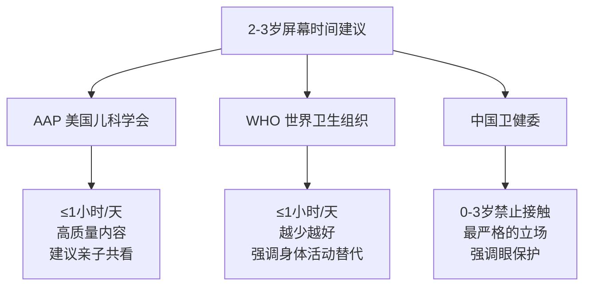

# 2-3岁幼儿屏幕时间：权威建议与研究证据综合报告

> 调研日期：2026-05-01
> 用途：为育儿 Skill 提供屏幕时间相关的循证建议

---

## 第一部分：权威机构建议

### 1.1 美国儿科学会（AAP）

| 项目 | 建议 |
|------|------|
| 适用年龄 | 2-5岁 |
| 屏幕时间上限 | 每天不超过1小时高质量节目 |
| 陪伴要求 | 建议家长与孩子共同观看（co-viewing） |
| 内容标准 | 节目应具有教育意义，节奏适中 |
| 禁止事项 | 避免快节奏节目、含大量暴力/广告的内容；**进餐时间和睡前1小时禁止使用屏幕** |
| 自媒体使用 | 18-24个月尽量避免数字媒体使用（视频通话除外） |

> **来源**：AAP Policy Statement "Media and Young Minds" (2016)，后续于2019-2020年更新补充。AAP强调关键不在于"完全不碰屏幕"，而在于内容选择和亲子互动。

### 1.2 世界卫生组织（WHO）

| 项目 | 建议 |
|------|------|
| 适用年龄 | 2-3岁（属于2-4岁年龄段） |
| 久坐屏幕时间 | 不应超过1小时，越少越好 |
| 身体活动 | 每天至少180分钟各种类型的身体活动，其中至少60分钟为中高强度 |
| 睡眠 | 每天应有10-13小时优质睡眠（含午睡） |
| 久坐约束 | 每次被约束（如婴儿车、高脚椅）时间不超过1小时 |

> **来源**：WHO Guidelines on Physical Activity, Sedentary Behaviour and Sleep for Children Under 5 Years of Age (2019)。WHO的核心立场是将屏幕时间视为"久坐行为"的一部分，强调的是用积极活动替代久坐，而非仅限制屏幕本身。

### 1.3 中国权威机构建议

| 机构 | 核心建议 |
|------|----------|
| 国家卫生健康委员会 | 0-3岁婴幼儿禁止接触手机、电脑等视屏类电子产品；3-6岁尽量避免接触和使用 |
| 中国疾病预防控制中心 | 0-3岁不建议使用电子屏幕；3岁以上每次使用不超过15分钟，每天累计不超过1小时 |
| 《中国人群身体活动指南（2021）》 | 2-4岁儿童每天至少180分钟身体活动，每次久坐不动持续时间不超过1小时 |
| 国家卫健委《0-6岁儿童眼保健核心信息》 | 0-3岁禁用手机、平板等电子产品；近距离注视每次不超过15分钟 |

### 1.4 各机构建议对比

**三方共识**：尽量减少、内容要高质量、禁止独处使用。

**分歧点**：中国立场最严格（"禁止"），AAP和WHO则采取"限制+引导"策略。

---

## 第二部分：研究证据

### 2.1 屏幕时间与语言发展

**剂量-反应关系**：多项研究一致发现屏幕时间与语言能力呈负相关。

- **魁北克纵向研究**：2岁时每增加1小时电视观看，到4年级时课堂参与度下降7%，数学能力下降6%。（来源：PMC10353947）
- **词汇学习关键发现**：22个月以下的儿童无法从电视中学到新词汇，但可以在自然环境中学习。这一现象被称为"视频缺陷"（video deficit）。（来源：PMC8905397）
- **内容类型的影响**：每天观看2小时以上儿童导向节目的幼儿，其沟通能力低下的风险是观看等量成人导向节目幼儿的6.25倍。（来源：PMC8905397）
- **起始年龄的影响**：越早开始大量接触屏幕，语言发展受到的负面影响越大。

**特定节目的对比研究**：

| 节目 | 对语言发展的影响 | 原因分析 |
|------|------------------|----------|
| Blue's Clues | 正面——提升词汇量 | 互动设计、重复模式、适中节奏 |
| Dora the Explorer | 正面——提升词汇量 | 双语互动、直接对着孩子说话 |
| Teletubbies | 负面——损害表达性语言 | 节奏过快、婴儿化语言、缺乏清晰互动 |

### 2.2 屏幕时间与注意力/执行功能

- **注意力影响**：婴幼儿期大量屏幕暴露与后续注意力问题存在关联。1-3岁每天观看电视的时长与7岁时出现注意力问题的概率正相关。（Christakis et al., 2004, Pediatrics）
- **执行功能下降**：频繁使用快节奏互动媒体的学龄前儿童，在自我调节、工作记忆和认知灵活性测试中表现较差。（PMC10353947）
- 快节奏的屏幕内容可能使儿童对慢节奏的现实世界活动失去兴趣，导致"注意力阈值提高"现象。

### 2.3 屏幕时间与社会情绪发展

- **社会技能替代效应**：每增加一小时屏幕时间，就意味着减少了一小时的社会互动、自由游戏和创造性活动时间。这种"机会成本"是屏幕时间影响社会发展的主要机制。
- **父母屏幕使用的代际影响**：父母每天观看电视超过4小时，其儿子出现同样行为的可能性增加10.5倍，女儿增加3倍。
- **情绪调节能力**：频繁依赖屏幕安抚的儿童，在情绪自我调节方面面临更多挑战，可能与缺少练习"无聊忍耐"和"自我安抚"的机会有关。

### 2.4 主动观看 vs 被动观看

**内容特征比时长更关键**：

| 维度 | 被动观看（风险较高） | 主动观看（相对有益） |
|------|----------------------|----------------------|
| 节奏 | 快速剪辑、场景频繁切换 | 适中节奏，给思考时间 |
| 互动性 | 单向输入，无回应要求 | 暂停等待孩子回应 |
| 语言 | 背景音或婴儿化语言 | 清晰、标准语言输入 |
| 内容 | 纯娱乐或成人节目 | 教育导向、适龄内容 |
| 结构 | 无规律叙事 | 重复模式、可预测结构 |

**评估教育类App的"四大支柱模型"**（Hirsh-Pasek et al., 2015）：

1. **主动学习**（Active Learning）——孩子需要思考而非被动点击
2. **参与度**（Engagement）——保持注意力但不过度刺激
3. **意义感**（Meaningful）——连接孩子已有的生活经验
4. **社会互动**（Social Interaction）——鼓励与现实人物交流

### 2.5 亲子共看（Co-viewing）的效果

- **共看与词汇发展**：亲子共看与更好的表达性词汇能力相关。家长在共看时提供额外解释和提问，能够强化学习效果。
- **共看的机制**：将被动屏幕体验转化为主动社会互动。家长充当"桥梁"，帮助孩子理解屏幕内容并与现实世界建立联系。
- **背景电视的干扰**：即使家长在场，背景电视开着也会降低亲子互动频率和深度。
- **重要提醒**：共看是一个"减害"策略，而非"增效"策略。它能部分缓解负面影响，但不能完全消除。

---

## 第三部分：实用建议

### 3.1 如何判断屏幕时间是否过量

| 维度 | 预警信号 |
|------|----------|
| 语言 | 词汇量增长缓慢、不愿用语言表达需求 |
| 注意力 | 无法专注于非屏幕活动超过几分钟 |
| 社交 | 减少眼神接触、不主动发起社交互动 |
| 情绪 | 关屏幕时出现剧烈情绪爆发、需要屏幕才能平静 |
| 睡眠 | 入睡困难、睡眠时间缩短 |
| 身体活动 | 明显低于同龄人的大运动能力、抗拒户外活动 |

**判断原则**：不是看"每天看了多久"这个单一数字，而是综合评估屏幕时间是否在"挤占"睡眠、身体活动、面对面社交和自由游戏的时间。

### 3.2 逐步减少屏幕时间的策略

**核心原则**：不要突然"断屏"，逐步过渡。

**具体步骤**：

1. **记录基线**：连续3天记录实际屏幕时间、内容和时段，不做评判
2. **设定合理目标**：当前每天2小时 → 每周减少15-30分钟 → 逐步向1小时以内靠近
3. **准备替代活动**：感官游戏、大运动活动、角色扮演、亲子阅读、生活参与
4. **建立可视化规则**：使用沙漏或计时器；"先X后Y"的惯例
5. **创造"无屏幕区"和"无屏幕时段"**：进餐时间、睡前1小时、卧室不放屏幕

### 3.3 如何选择更好的屏幕内容

| 优先选择 | 尽量避免 |
|----------|----------|
| 适中节奏，给思考留白 | 快速剪辑、频繁场景切换 |
| 有互动设计，暂停等待回应 | 纯被动观看，无互动要求 |
| 使用标准、清晰的语言 | 婴儿化语言或含糊发音 |
| 有教育目标且经过验证 | 纯娱乐或暴力内容 |
| 单集时间短（15-20分钟） | 单集时间过长 |

**实用工具**：
- **Common Sense Media**（commonsensemedia.org）：按年龄分级的媒体内容评测

### 3.4 如何应对减少屏幕时间后的情绪反应

| 情境 | 建议做法 | 不建议做法 |
|------|----------|------------|
| 关屏幕时哭闹 | 提前预告"还有5分钟"，用计时器可视化 | 突然关掉不给任何预告 |
| 抱怨"无聊" | 接纳情绪，然后一起选一个活动 | 立即给屏幕以止哭 |
| 反复要求看屏幕 | 温和但坚定地重复规则 | 有时答应有时拒绝（不一致会强化请求行为） |
| 情绪升级 | 陪伴在旁，帮孩子命名情绪 | 威胁"再哭就永远不给你看了" |
| 成功转移注意力后 | 及时肯定具体行为 | 只关注"没哭"这件事 |

**关键心态**：
1. **一致性比强度更重要**——规则每天一样比偶尔严格更有效
2. **提供而非剥夺**——重点不是"不让你看"，而是"我们有更有趣的事做"
3. **允许不适**——适度的无聊感是创造力和自我调节能力的培养土壤
4. **全家一致**——如果成人自己频繁刷手机，很难让孩子理解为什么要减少屏幕时间

---

## 参考文献与信息来源

| 编号 | 来源 | 类型 |
|------|------|------|
| 1 | AAP Policy Statement "Media and Young Minds" (2016) | 权威机构指南 |
| 2 | WHO Guidelines on Physical Activity, Sedentary Behaviour and Sleep for Children Under 5 (2019) | 权威机构指南 |
| 3 | 国家卫健委《0-6岁儿童眼保健核心信息》(2023) | 权威机构指南 |
| 4 | 《中国人群身体活动指南（2021）》 | 权威机构指南 |
| 5 | PMC10353947 - "Effects of Excessive Screen Time on Child Development" (Cureus, 2023) | 系统综述 |
| 6 | PMC8905397 - "The influence of screen time on children's language development: A scoping review" (SAJCD, 2022) | 范围综述 |
| 7 | Christakis et al. (2004) "Early Television Exposure and Subsequent Attentional Problems in Children" (Pediatrics) | 原始研究 |
| 8 | Hirsh-Pasek et al. (2015) "Putting Education in 'Educational' Apps" (Psychological Science in the Public Interest) | 专家综述 |
| 9 | Common Sense Media (commonsensemedia.org) | 实用工具/内容评测平台 |
