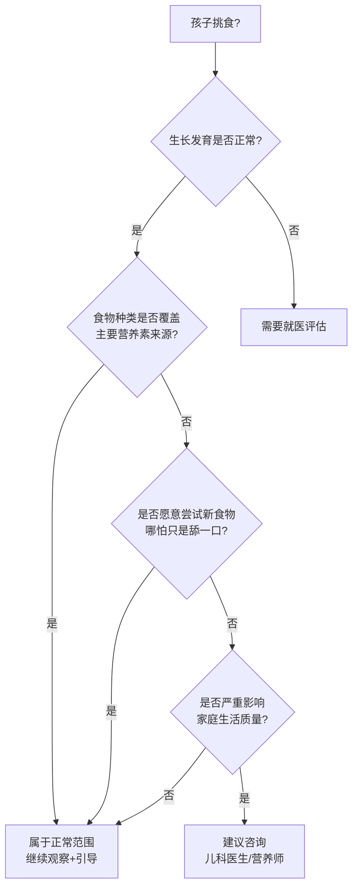
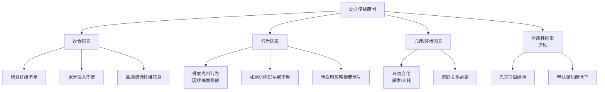
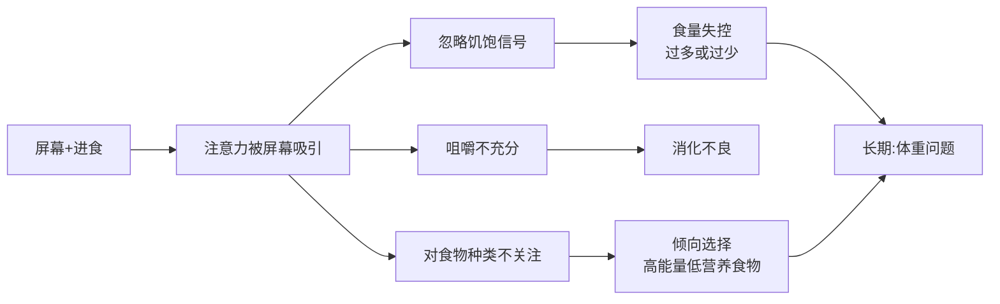

# 1-3岁幼儿营养与健康指南

> 整理日期：2026-05-01
> 数据来源：中国营养学会、AAP（美国儿科学会）、WHO（世界卫生组织）、Mayo Clinic、RCH Melbourne 等
> 适用对象：26月龄男孩（兼顾1-3岁通用参考）

---

## 一、幼儿膳食指南

### 1.1 《中国居民膳食指南（2022）》婴幼儿核心原则

中国营养学会针对7-24月龄婴幼儿提出 **5条核心推荐**：

| 序号 | 核心原则 | 说明 |
|------|---------|------|
| 1 | 继续母乳喂养，满6月龄起添加辅食 | 1-2岁建议继续母乳；不能母乳时用配方奶 |
| 2 | 从富含铁的糊状食物开始，逐步添加多样食物 | 首先添加铁强化米粉、肉泥等 |
| 3 | 提倡顺应喂养，鼓励但不强迫进食 | 尊重孩子的饥饱信号 |
| 4 | 辅食不加调味品，尽量减少糖和盐 | 1-3岁盐不超过1.5g/天 |
| 5 | 注重饮食卫生和进食安全 | 避免窒息风险食物 |

### 1.2 每日食物种类和摄入量建议

| 食物类别 | 1-2岁 | 2-3岁 | 备注 |
|---------|-------|-------|------|
| **母乳/配方奶** | 400-600 mL | 400-500 mL | 逐步过渡到普通牛奶（2岁后可喝低脂奶） |
| **谷类** | 50-75 g | 75-100 g | 粗细搭配，适当加入全谷物 |
| **蔬菜类** | 50-100 g | 100-150 g | 深色蔬菜占一半以上 |
| **水果类** | 50-100 g | 100-150 g | 新鲜水果为主，不用果汁替代 |
| **肉/禽/鱼/蛋** | 50-75 g | 50-75 g | 鸡蛋1个，鱼禽肉交替 |
| **豆制品** | 适量 | 适量 | 豆腐、豆浆等补充植物蛋白 |
| **油脂** | 5-10 g | 10-15 g | 推荐亚麻籽油、核桃油等植物油 |

**每日餐次安排**：3顿正餐 + 2次加餐（以奶、水果为主）

**关键限制**：

| 项目 | 建议 |
|------|------|
| 盐 | 1岁以内不加盐；1-3岁每日不超过1.5g |
| 糖 | 不添加游离糖，不喝含糖饮料 |
| 蜂蜜 | 1岁以内禁用（肉毒杆菌风险） |
| 坚果 | 整粒有窒息风险，须碾碎后食用 |
| 饮水量 | 1-3岁每日约300-600 mL（不含奶量） |

### 1.3 每日营养素参考值

依据《中国居民膳食营养素参考摄入量》（中国营养学会）：

| 营养素 | 1-3岁推荐量 | 主要食物来源 |
|--------|-----------|-------------|
| **蛋白质** | 25-30 g/天 | 鸡蛋、肉禽鱼、豆制品、奶 |
| **钙** | 600 mg/天 | 奶制品、豆腐、深绿色蔬菜 |
| **铁** | 10 mg/天 | 红肉、动物肝脏、铁强化米粉 |
| **锌** | 4 mg/天 | 瘦肉、鱼、蛋 |
| **维生素A** | 310 μg RAE/天 | 肝脏、胡萝卜、深色蔬菜 |
| **维生素D** | 600 IU/天 | 补充剂为主，日光照射为辅 |
| **膳食纤维** | 约10-15 g/天（或年龄+5g） | 蔬菜、水果、全谷物 |
| **能量** | 约900-1000 kcal/天 | — |

> **注意**：维生素D建议从出生后即开始补充，至少补充到3岁，每日400-600 IU。

---

## 二、挑食问题

### 2.1 正常范围 vs 需要干预的判断标准

**正常范围内的挑食表现**：
- 对新食物需要多次暴露才接受（8-15次）
- 有几样"绝对不吃"的食物，但整体种类尚可
- 偶尔某顿饭吃很少，但全天总摄入正常
- 食欲随生长速度波动（生长减速期食量自然减少）

**需要干预的信号**：
- 体重/身高百分位持续下降（跨越2条百分位线）
- 拒绝整类食物（如所有蔬菜、所有肉类）
- 进食时频繁干呕、呕吐
- 只接受特定质地的食物（如只吃糊状）
- 进餐变成持续的家庭冲突

### 2.2 食物新恐症（Food Neophobia）

**定义**：对不熟悉的食物表现出拒绝或抗拒的行为。这是一种**具有进化保护意义的自然机制**，而非简单的"挑食"。

**科学解释**：

| 维度 | 说明 |
|------|------|
| **进化保护** | 早期人类为避免误食有毒植物，演化出对陌生食物的天然警惕 |
| **遗传因素** | 基因影响味觉感受器的敏感度；部分儿童为"超级味觉者"（supertaster），对苦味更敏感 |
| **发育阶段** | 2-6岁是食物新恐症的高峰期，这与幼儿开始独立探索食物的年龄吻合 |
| **后天环境** | 家庭饮食模式、父母的喂养方式、社交环境共同影响 |

**关键区别**：
- **食物新恐症**：针对"不熟悉"食物的拒绝，可通过反复暴露改善
- **挑食**：对特定食物类别的长期排斥，可能涉及感官敏感

### 2.3 不喜欢咀嚼的可能原因

不喜欢咀嚼并非单纯的"偷懒"或"任性"，背后可能有多重原因：

| 原因类型 | 具体表现 | 参考判断 |
|---------|---------|---------|
| **口腔运动发展不足** | 咀嚼时嘴巴张很大、食物从嘴边掉出、咀嚼效率低、吃东西很慢 | 可咨询言语治疗师（ST）/职能治疗师（OT） |
| **质感/感官敏感** | 只接受特定质地的食物（如只吃软糊状）、对粗糙食物表现出强烈抗拒 | 可能与感觉统合有关 |
| **口腔运动 vs 感官**的鉴别 | 口腔运动问题：想吃但处理不了（gag、食物掉出来）；感官问题：能处理但抗拒接触 | 需专业人员评估 |

**口腔运动发展里程碑参考**：

| 月龄 | 预期能力 |
|------|---------|
| 6-8月 | 上下咬合动作（用嘴唇和牙龈） |
| 9-12月 | 侧向咀嚼的萌芽（舌头将食物移到两侧） |
| 12-18月 | 更成熟的咀嚼模式，能处理碎块食物 |
| 18-24月 | 旋转式咀嚼，能处理大部分家庭食物 |
| 24-36月 | 接近成人的咀嚼模式 |

> **来源**：[RCH Melbourne - Physical, Sensory and Oral Motor Development](https://www.rch.org.au/feedingdifficulties/difficulties/physical/)、[ARK Therapeutic - Food Refusal: Oral Motor or Sensory?](https://www.arktherapeutic.com/blog/food-refusal-is-it-oral-motor-or-sensory-related/)

### 2.4 循证有效的应对策略

| 策略 | 具体做法 | 证据等级 |
|------|---------|---------|
| **反复暴露** | 将新食物反复放在孩子面前，不要求吃。研究显示通常需要 **8-15次暴露** 才能接受 | 强 |
| **示范进食** | 父母与孩子同食同样的食物，利用社会学习原理 | 强 |
| **不强迫、不奖惩** | 威胁、奖励（"吃完青菜就给你糖"）反而会降低对目标食物的偏好 | 强 |
| **"一加一"原则** | 每餐在熟悉食物旁放一种新食物，降低陌生感 | 中等 |
| **让孩子参与** | 参与食材选购和烹饪过程，增加对食物的熟悉感和掌控感 | 中等 |
| **营造正向氛围** | 让用餐环境轻松愉快，避免餐桌上施加压力 | 专家共识 |
| **食物命名/故事化** | 给蔬菜起有趣的名字（"恐龙吃的树"=西兰花） | 中等 |

**顺应喂养的核心原则**（WHO/UNICEF推荐）：

- **家长决定**：提供什么食物、何时提供、在哪里吃
- **孩子决定**：吃不吃、吃多少
- 不要用"再吃一口"代替孩子对自己饥饱信号的判断

---

## 三、幼儿便秘

### 3.1 正常排便频率

| 年龄段 | 正常频率 | 说明 |
|--------|---------|------|
| 新生儿 | 每天4次或更多 | 母乳宝宝可达每次喂奶后排便 |
| 婴儿期（0-1岁） | 每天2-4次 | 母乳宝宝可能数天1次也属正常 |
| **幼儿期（1-3岁）** | **每天1-2次或隔天1次** | 个体差异较大，规律性和性状比频率更重要 |

> **关键判断标准**：频率不是唯一指标，**大便性状和排便时的状态**更为重要。

### 3.2 布里斯托大便分类法

布里斯托大便分类法（Bristol Stool Scale）是判断大便性状的国际通用标准，已有经过验证的**幼儿改良版（m-BSFS）**：

| 类型 | 形状描述 | 判断 |
|------|---------|------|
| **Type 1** | 坚硬的颗粒状，像坚果（难以排出） | 便秘 |
| **Type 2** | 腊肠状，表面凹凸不平 | 偏便秘 |
| **Type 3** | 腊肠状，表面有裂痕 | 接近正常 |
| **Type 4** | 腊肠状，光滑柔软（理想型） | 正常 |
| **Type 5** | 柔软的块状，边缘清晰 | 偏软 |
| **Type 6** | 糊状，蓬松，边缘模糊 | 偏腹泻 |
| **Type 7** | 水状，无固体块 | 腹泻 |

**幼儿便秘的大便通常对应 Type 1 和 Type 2**，表现为干硬、颗粒状或粗大块状。

> 来源：[Cleveland Clinic - Bristol Stool Chart](https://my.clevelandclinic.org/health/articles/bristol-stool-chart)、[Modified BSFS for Toddlers (JPGN 2021)](https://www.frieslandcampinainstitute.com/uploads/sites/19/2023/03/Wegh-CAM-et-al-JPGN-2021_Modified-Bristol-Stool-Scale_method-validation_Dutch-toddlers.pdf)

### 3.3 幼儿便秘的常见原因

幼儿便秘中 **90%以上为功能性便秘**（非器质性病变）。

**功能性便秘的诊断标准**（罗马IV标准，符合以下 >= 2项，持续 > 1个月）：

- 每周排便 <= 2次
- 有大便失禁（溢粪）现象
- 有憋便姿势或主动抑制排便史
- 排便疼痛或困难史
- 直肠内存在巨大粪块
排便直径过粗

> 来源：[RACGP - Childhood Constipation](https://www.racgp.org.au/afp/2017/december/childhood-constipation)、[MedSci](https://general.medsci.cn/article/show_article.do?id=cc398668164d)

### 3.4 家庭处理方法

#### 膳食纤维

**推荐摄入量**：年龄 + 5 = 每日克数（常见临床经验公式）

| 年龄 | 每日膳食纤维建议 |
|------|---------------|
| 1岁 | 约6g |
| 2岁 | 约7g |
| 3岁 | 约8g |

**高纤维食物参考**：

| 食物 | 膳食纤维含量（每100g） |
|------|-----|
| 西梅 | 7.1g |
| 梨（带皮） | 3.1g |
| 苹果（带皮） | 2.4g |
| 火龙果 | 2.0g |
| 西兰花 | 2.6g |
| 燕麦 | 10.3g |
| 红薯 | 2.5g |

#### 综合处理方案

| 措施 | 具体做法 |
|------|---------|
| **增加膳食纤维** | 多吃蔬菜、水果（西梅、梨、火龙果效果较好）、全谷物 |
| **充足水分** | 每日300-600mL白水（不含奶量）；增加纤维的同时必须增加饮水 |
| **建立规律排便习惯** | 每天固定时间（如早饭后）坐便器5-10分钟，使用脚踏凳确保双脚有支撑 |
| **适当运动** | 户外活动和游戏促进肠道蠕动 |
| **腹部按摩** | 顺时针方向轻揉腹部 |
| **心理疏导** | 消除对排便的恐惧，不因失禁事件责备孩子 |

> 来源：[RCH Melbourne - Constipation Guideline](https://www.rch.org.au/clinicalguide/guideline_index/constipation_guideline/)、[SA Health - Managing Constipation in Children](https://www.sahealth.sa.gov.au/wps/wcm/connect/public+content/sa+health+internet/resources/chronic+constipation+and+soiling+in+children+consumer+health+information+-+paediatrics+fmc)

### 3.5 什么时候需要就医

| 信号 | 说明 |
|------|------|
| 便秘持续超过2周 | 可能需要药物干预 |
| 便血 | 可能存在肛裂 |
| 腹痛、腹胀明显 | 需排除肠梗阻 |
| 呕吐伴便秘 | 需排除肠梗阻 |
| 大便失禁（溢粪） | 提示粪块嵌塞 |
| 生长发育迟缓 | 可能存在器质性病变 |
| 新生儿期即出现便秘 | 需排除先天性巨结肠症 |
| 家庭饮食调整2周后仍无改善 | 需专业评估 |

> 来源：[Mayo Clinic - Constipation in Children](https://www.mayoclinic.org/zh-hans/diseases-conditions/constipation-in-children/symptoms-causes/syc-20354242)、[默沙东诊疗手册 - 儿童便秘](https://www.msdmanuals.cn/home/children-s-health-issues/symptoms-in-infants-and-children/constipation-in-children)

---

## 四、边看屏幕边吃饭

### 4.1 官方屏幕时间建议

| 机构 | 建议 |
|------|------|
| **AAP（美国儿科学会）** | 18月龄以下：避免使用任何屏幕媒体（视频通话除外）；18-24月龄：仅限高质量节目且须家长陪同；2-5岁：每天不超过1小时高质量节目；**餐时：建议无屏幕区域和无屏幕时段** |
| **WHO（世界卫生组织）** | 1岁以内：零屏幕时间；1-2岁：久坐屏幕时间不超过1小时（越少越好）；3-4岁：久坐屏幕时间不超过1小时（越少越好）；静态活动时应以阅读和讲故事替代 |

> 来源：[WHO Guidelines on Physical Activity, Sedentary Behaviour and Sleep (2019)](https://apps.who.int/iris/bitstream/handle/10665/325147/WHO-NMH-PND-2019.4-eng.pdf)、[AAP - Toddler Food and Feeding](https://www.aap.org/en/patient-care/healthy-active-living-for-families/toddler-food-and-feeding/)

### 4.2 屏幕对幼儿饮食行为的影响

#### 对食量的影响

一项涵盖 **50项研究** 的系统综述和荟萃分析发现：

- **即时影响**：分心进食导致当餐摄入量中等程度增加（标准化均数差 SMD: 0.39）
- **后续影响**：分心进食导致**下一餐摄入量进一步增加**，产生叠加效应
- **机制**：屏幕干扰了大脑对进食的记忆编码，导致饱腹感信号被削弱

> 来源：[Eating Attentively: Systematic Review and Meta-Analysis (PMC/NIH)](https://pmc.ncbi.nlm.nih.gov/articles/PMC3607652/)

#### 对食物选择的影响

- 边看屏幕边吃饭的孩子倾向选择**更多能量密集、低营养密度的食物**（加工零食、甜食）
- 屏幕广告进一步强化对不健康食物的偏好
- 被屏幕吸引的幼儿更**不愿意探索新食物**，可能加重挑食行为

#### 对消化的影响

| 影响环节 | 说明 |
|---------|------|
| **消化头相（Cephalic Phase）** | 看到和闻到食物时触发唾液、胃酸和消化酶的分泌；屏幕分散注意力，削弱此阶段 |
| **咀嚼质量** | 专注于屏幕时咀嚼不充分，导致食物颗粒过大，影响营养吸收 |
| **脑-肠轴** | 无意识进食可能扰乱饥饿-饱腹激素（胃饥饿素ghrelin和瘦素leptin）的调节 |

#### 长期风险

- UCSF 一项研究发现，**9-11岁儿童屏幕时间越多，一年后越可能发展为暴食症**
- 边看屏幕边吃饭的习惯与**儿童肥胖风险增加**相关
- 错过了餐桌上的社交互动和语言发展机会

> 来源：[Harvard Health - Distracted Eating May Add to Weight Gain](https://www.health.harvard.edu/blog/distracted-eating-may-add-to-weight-gain-201303296037)、[UCSF Pediatrics - Screen Time and Binge Eating](https://pediatrics.ucsf.edu/news/how-screen-time-leads-binge-eating)

### 4.3 建议

1. **餐时零屏幕**：正餐和加餐时均不使用手机、平板、电视
2. **餐桌为无屏幕区域**：将餐桌设为家庭"科技禁区"
3. **家长以身作则**：家长自己也不在餐桌上使用手机
4. **用餐作为社交时间**：用对话、分享当天经历替代屏幕
5. **执行全家媒体计划**：制定并坚持 Family Media Plan

---

## 参考来源汇总

### 权威机构指南

| 来源 | 链接 |
|------|------|
| 中国营养学会 - 中国居民膳食指南（2022） | 官方出版物 |
| WHO - Guidelines on Physical Activity, Sedentary Behaviour and Sleep (2019) | https://apps.who.int/iris/bitstream/handle/10665/325147/WHO-NMH-PND-2019.4-eng.pdf |
| AAP - Toddler Food and Feeding | https://www.aap.org/en/patient-care/healthy-active-living-for-families/toddler-food-and-feeding/ |
| Mayo Clinic - Constipation in Children | https://www.mayoclinic.org/zh-hans/diseases-conditions/constipation-in-children/symptoms-causes/syc-20354242 |
| RCH Melbourne - Constipation Guideline | https://www.rch.org.au/clinicalguide/guideline_index/constipation_guideline/ |
| Cleveland Clinic - Bristol Stool Chart | https://my.clevelandclinic.org/health/articles/bristol-stool-chart |
| 默沙东诊疗手册 - 儿童便秘 | https://www.msdmanuals.cn/home/children-s-health-issues/symptoms-in-infants-and-children/constipation-in-children |

### 研究文献

| 来源 | 链接 |
|------|------|
| Eating Attentively: Systematic Review and Meta-Analysis (PMC) | https://pmc.ncbi.nlm.nih.gov/articles/PMC3607652/ |
| Modified Bristol Stool Scale for Toddlers (JPGN 2021) | https://www.frieslandcampinainstitute.com/uploads/sites/19/2023/03/Wegh-CAM-et-al-JPGN-2021_Modified-Bristol-Stool-Scale_method-validation_Dutch-toddlers.pdf |
| Pediatric Oral Sensorimotor Interventions for Chewing Dysfunction (PMC) | https://pmc.ncbi.nlm.nih.gov/articles/PMC8585681/ |
| Harvard Health - Distracted Eating | https://www.health.harvard.edu/blog/distracted-eating-may-add-to-weight-gain-201303296037 |

### 实用资源

| 来源 | 链接 |
|------|------|
| ARK Therapeutic - Food Refusal: Oral Motor or Sensory? | https://www.arktherapeutic.com/blog/food-refusal-is-it-oral-motor-or-sensory-related/ |
| RCH Melbourne - Physical, Sensory and Oral Motor Development | https://www.rch.org.au/feedingdifficulties/difficulties/physical/ |
| RACGP - Childhood Constipation | https://www.racgp.org.au/afp/2017/december/childhood-constipation |
