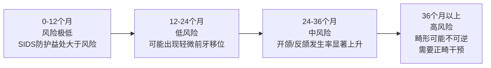
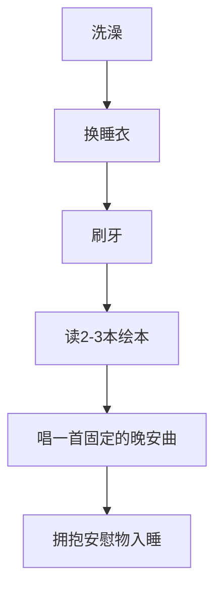

# 奶嘴戒除循证指南（2-3岁幼儿）

> 适用对象：2-3岁幼儿家长 / 育儿顾问知识库
> 内容性质：基于权威机构指南与同行评审研究的循证建议
> 最后更新：2026-05

---

## 目录

1. [时机与风险](#1-时机与风险)
2. [戒除准备信号](#2-戒除准备信号)
3. [戒除方法详解](#3-戒除方法详解)
4. [睡眠管理](#4-戒除期间的睡眠管理)
5. [问题排查](#5-问题排查与应对)
6. [绘本推荐](#6-辅助绘本推荐)
7. [年龄分段要点](#7-年龄分段要点)
8. [参考文献](#8-参考文献)

---

## 1. 时机与风险

### 1.1 权威机构推荐时间线

| 机构 | 推荐戒除时间 | 核心关切 |
|------|-------------|---------|
| **AAP** (American Academy of Pediatrics) | 建议12个月开始减少，最迟不超过3岁 | 中耳炎风险、牙齿发育 |
| **AAPD** (American Academy of Pediatric Dentistry) | 建议2-3岁完成戒除 | 开颌、后牙反颌、牙颌畸形 |
| **AAFP** (American Academy of Family Physicians) | 建议6个月后开始减少使用 | 中耳炎、口腔发育 |
| **ADA** (American Dental Association) | 建议2岁前开始戒除，3岁前完成 | 咬合异常 |

**核心结论**：各机构一致认为，奶嘴使用应在 **2-3岁之间** 完成戒除。AAP 侧重于尽早减少（因中耳炎风险），AAPD 则给予稍宽的时间窗口（因牙颌问题在2-3岁期间可能自行纠正）。

### 1.2 牙齿风险时间线

**关键牙颌问题**：

| 问题 | 表现 | 发生机制 | 可逆性 |
|------|------|---------|--------|
| **前牙开颌** (Anterior Open Bite) | 上下前牙无法闭合 | 吸吮动作将舌头下压、前牙外推 | 3岁前戒除，多数可自行恢复 |
| **后牙反颌** (Posterior Crossbite) | 上颌后牙咬在下颌后牙内侧 | 奶嘴阻碍舌头正常抵住上颚，上颌骨发育受限 | 3-4岁前戒除有较高自行恢复概率 |
| **覆盖增大** (Increased Overjet) | 上前牙过度前突 | 持续吸吮压力推前牙向前 | 早期戒除可恢复 |

**重要研究**：Medeiros et al. (2014) 系统综述发现，2岁后持续使用奶嘴，前牙开颌和后牙反颌的几率显著增加。Lima et al. (2015) 研究证实了奶嘴使用时长与牙颌畸形之间的剂量-反应关系。

### 1.3 中耳炎风险

**研究发现**：

- 奶嘴使用者发生急性中耳炎（AOM）的风险是 **非使用者的2-3倍**（Niemelä et al., 1995, *Pediatrics*）
- 存在 **剂量-反应关系**：持续使用比偶尔使用风险更高
- 同时使用奶嘴 + 奶瓶喂养 + 日托的儿童，中耳炎风险高达 **5倍**

**机制**：吸吮奶嘴会改变鼻咽部压力，可能影响咽鼓管（Eustachian tube）功能，促进鼻咽分泌物向中耳反流。

**临床建议**：
- 10个月后应限制奶嘴仅用于入睡
- 白天清醒时不应使用奶嘴
- 中耳炎反复发作的儿童应优先考虑戒除

### 1.4 语言发育影响

| 方面 | 研究证据 | 说明 |
|------|---------|------|
| **发音清晰度** | 长时间使用可能影响构音 | 奶嘴减少咿呀学语和发音练习时间 |
| **词汇量** | 研究结论不一致 | 有研究显示负面影响，也有研究（Frontiers in Psychology, 2025）未发现显著影响 |
| **口腔肌肉** | 可能影响口腔运动发育 | 持续吸吮模式影响舌头和唇部肌肉发展 |
| **沟通意愿** | 嘴里含奶嘴减少社交互动 | 幼儿可能选择不说话而非取下奶嘴 |

**关键区分**：**白天高频使用**（数小时）对语言发育的影响远大于 **仅睡前使用**。如果已经限制到仅入睡使用，语言风险较低。

> **来源**：PMC/NIH (PMC10912588); ScienceDirect (Speech-Motor Account, 2021); Expressable; Boys Town Hospital

---

## 2. 戒除准备信号

### 2.1 幼儿准备就绪的信号

| 信号类别 | 具体表现 |
|---------|---------|
| **语言能力** | 能理解简单因果关系（"奶嘴送给小宝宝"）；能用简单语言表达情绪（"我难过"） |
| **自我安抚** | 已有其他安抚方式（拥抱毛绒玩具、毯子）；偶尔能不用奶嘴自行入睡 |
| **认知发展** | 对"长大"的概念有初步理解；能参与简单的仪式活动 |
| **情绪稳定** | 近期没有重大生活变化（搬家、新Sibling、换园）；日常情绪相对平稳 |
| **使用模式** | 白天自然使用频率已降低；有时忘记要奶嘴 |

### 2.2 不宜戒除的时机

以下情况应 **暂缓戒除计划**：

- 刚刚搬家或即将搬家
- 家中新增成员（新生儿）
- 刚开始上托班/幼儿园
- 孩子正在生病（感冒、发烧、出牙期）
- 经历其他重大日常变化
- 家庭正经历压力期（家长工作变动等）

**原则**：每次只应对一个重大变化。如果已有其他过渡在进行，等其稳定后再开始戒除奶嘴。

### 2.3 戒除前的准备工作

1. **提前1-2周沟通**：反复温柔地提到"你长大了，奶嘴快要和小宝宝说再见了"
2. **引入替代安抚物**：在戒除前让孩子选择一个新的毛绒玩具或小毯子作为"安慰伙伴"
3. **阅读相关绘本**：通过故事让孩子理解戒除的概念（见绘本推荐章节）
4. **观察并记录**：记录孩子自然使用奶嘴的时段，了解哪些场景最难替代
5. **减少可见性**：将奶嘴收起来，不放在显眼位置，"需要时再拿"

---

## 3. 戒除方法详解

> **重要原则**：没有一种方法适用于所有孩子。选择方法时应考虑孩子的性格、年龄和理解能力。**家长的坚持和一致性是成功的关键因素**，这一点已得到多项行为研究支持。

### 方法一：渐进限制法（限制使用场景）

**适合年龄**：18个月 - 3岁
**适合性格**：适应力较慢、对变化敏感的孩子

**操作步骤**：

| 阶段 | 行动 | 预计持续时间 |
|------|------|------------|
| 第1阶段 | 仅在睡眠时间（午睡+晚上）使用，白天完全不给 | 1-2周 |
| 第2阶段 | 仅在晚上入睡时使用，午睡不提供 | 1-2周 |
| 第3阶段 | 入睡时提供，但睡着后轻轻取出不放回 | 1周 |
| 第4阶段 | 完全不提供奶嘴 | - |

**关键技巧**：
- 白天用"奶嘴要睡觉了"来解释收起来的原因
- 在不能用的时段提供替代安抚（拥抱、讲故事、小零食）
- 每个阶段等孩子基本适应后再进入下一阶段
- 如果某个阶段回退，回到上一阶段重新开始，不要急躁

**优点**：冲突少、孩子适应更自然
**缺点**：耗时较长、需要家长持续一致

---

### 方法二：奶嘴仙女法（Binky Fairy / Pacifier Fairy）

**适合年龄**：2-3岁（需要有一定的象征思维）
**适合性格**：喜欢故事和仪式感的孩子

**操作步骤**：

1. **铺垫**：提前3-5天开始讲"奶嘴仙女"的故事——"奶嘴仙女会把大孩子的奶嘴收走，送给需要的小宝宝，然后留给你一个礼物"
2. **约定日期**：和孩子一起选定一个"送走奶嘴"的日子，可以在日历上画圈
3. **仪式**：当天晚上，让孩子把所有奶嘴放在一个漂亮的袋子里/盒子里，放在枕头下或门口
4. **交换**：孩子睡着后，家长收走奶嘴，放上一个孩子期待的小礼物（玩具、绘本等）
5. **庆祝**：第二天早上一起"发现"礼物，庆祝孩子长大了

**变体**：
- 送给"新生儿"：带孩子把奶嘴装好，"寄给"或"送给"认识的新生儿家庭
- 送给"小动物"：把奶嘴埋在花园里"给小松鼠的宝宝"

**优点**：仪式感强，孩子有参与感和成就感
**缺点**：需要孩子能理解故事逻辑；若孩子抗拒"送走"概念可能适得其反

---

### 方法三：安慰物交换法（Trading for a New Comfort Object）

**适合年龄**：2-3岁
**适合性格**：有明确喜好、对新玩具有兴趣的孩子

**操作步骤**：

1. 带孩子去商店，让他/她自己挑选一个"特别的睡觉伙伴"（毛绒玩具、小毯子等）
2. 和孩子约定："这个新朋友会代替奶嘴陪你睡觉"
3. 第一天晚上开始，只用新伙伴，不提供奶嘴
4. 如果孩子哭闹，用新伙伴替代安抚："小熊在这里陪你，我们一起抱抱它"
5. 将新伙伴融入整个睡前流程

**关键点**：
- 让孩子 **自己选择** 安慰物，而非家长指定
- 安慰物最好有触感柔软、可拥抱的特点
- 可以提前几天让安慰物"陪伴"孩子玩耍，建立情感连接

**优点**：正向替代，非剥夺感
**缺点**：不一定每个孩子都能立即接受替代物

---

### 方法四：剪掉奶嘴尖端法（Cutting the Tip）

> **安全警告：此方法存在争议，需谨慎使用**

**原理**：剪掉奶嘴尖端的很小一部分，减少吸吮时的真空感，使奶嘴"不好用了"，孩子可能自己失去兴趣。

**操作要点**：
- 每次只剪掉极小一点（约1-2mm）
- 每隔2-3天剪一次，逐步减少
- 当剪口足够大时，孩子通常会自己拒绝使用

**安全风险**：

| 风险 | 说明 |
|------|------|
| **窒息危险** | 剪切削弱奶嘴结构完整性，可能产生碎片 |
| **不符合联邦标准** | 改造后的奶嘴不再符合 CPSC 16 CFR Part 1511 安全标准 |
| **意外撕裂** | 剪口处可能进一步撕裂，产生小碎片 |

**专家建议**：
- **CPSC**（美国消费品安全委员会）明确不建议改造奶嘴
- 部分儿科牙医认为"小量逐步剪"风险可控，但需全程监督
- 如果采用此法，**绝不能让孩子单独使用已剪过的奶嘴**，每次使用后检查完整性
- **替代方案**：用针在奶嘴尖端扎一个小孔（而非剪切），同样减少真空但结构破坏更小，但仍需谨慎

> **综合建议**：鉴于安全风险，推荐优先尝试其他方法。如确要使用，务必全程监护，出现任何磨损立即丢弃。

---

### 方法五：绘本辅助法（Reading Books About Giving Up Pacifiers）

**适合年龄**：18个月 - 3岁
**适合性格**：喜欢听故事的孩子（几乎适用于所有孩子作为辅助手段）

**操作方式**：

1. 戒除前1-2周开始每日阅读相关绘本
2. 阅读时讨论故事角色的感受："小猪也不舍得，但是它做到了！"
3. 让孩子与故事角色产生认同感
4. 将绘本中的情节与即将进行的戒除计划关联

**推荐书目见 [第6章 绘本推荐](#6-辅助绘本推荐)**

**优点**：非对抗性、通过故事建立认知基础
**缺点**：单独使用效果有限，需结合其他方法

---

### 方法六：一次性戒除法（Cold Turkey）

**适合年龄**：2.5-3岁
**适合性格**：适应力强、家长执行力好的家庭

**操作要点**：

1. **提前告知**："再过3天，我们就不吃奶嘴了，因为你长大了"
2. **选定日期后彻底执行**：收起/丢弃所有奶嘴，家中不留任何备用
3. **预期哭闹**：前1-3天晚上可能有较激烈的哭闹（30-60分钟），这是正常的
4. **温柔但坚定**：可以拥抱、安慰，但不能给回奶嘴
5. **表扬和强化**：每当孩子不用奶嘴度过困难时刻，给予具体表扬

**适用场景**：
- 渐进法尝试多次失败
- 家长有足够的耐心和精力应对短期高强度哭闹
- 孩子已经能理解"奶嘴没有了"的概念
- 即将有牙科检查或医生建议需要尽快戒除

**不适用场景**：
- 孩子正在经历其他生活变化
- 家长无法承受连续几天的睡眠中断
- 孩子有严重的分离焦虑

**优点**：最快速（通常3-7天完成）；避免了长期拉锯
**缺点**：短期内亲子压力较大；可能出现暂时性行为倒退

---

### 方法七：告别仪式法（"Bye-Bye" Ceremony）

**适合年龄**：2-3岁
**适合性格**：喜欢参与和表达的孩子

**操作步骤**：

1. **和孩子一起策划**："我们给奶嘴办一个告别派对吧！"
2. **准备仪式**：
   - 画一幅"和奶嘴在一起"的画
   - 拍一张"最后的合影"
   - 做一个"奶嘴盒"用来存放（之后收起来）
3. **正式告别**：
   - 在约定时间举行简单仪式
   - 让孩子亲手把奶嘴放进盒子/袋子
   - 一起说"谢谢奶嘴陪我长大，再见！"
   - 可以吹泡泡或贴贴纸庆祝
4. **后续强化**：
   - 把"告别照片"贴在墙上
   - 当孩子想念奶嘴时，一起看照片回忆："你已经和奶嘴说再见了，你做得很棒"

**优点**：孩子有参与感和控制感，情绪处理更健康
**缺点**：需要一定的准备时间

---

### 方法选择速查表

| 方法 | 耗时 | 冲突强度 | 适用年龄 | 推荐指数 |
|------|------|---------|---------|---------|
| 渐进限制法 | 2-6周 | 低 | 18m-3y | ★★★★★ |
| 奶嘴仙女法 | 1-2周 | 低-中 | 2-3y | ★★★★☆ |
| 安慰物交换 | 1-2周 | 中 | 2-3y | ★★★★☆ |
| 剪掉尖端法 | 1-3周 | 低 | 2-3y | ★★☆☆☆ (有安全顾虑) |
| 绘本辅助法 | 持续1-4周 | 极低 | 18m-3y | ★★★★★ (辅助) |
| 一次性戒除 | 3-7天 | 高 | 2.5-3y | ★★★☆☆ |
| 告别仪式法 | 1-3天 | 低-中 | 2-3y | ★★★★☆ |

> **策略建议**：最佳方案通常是 **渐进限制法 + 绘本辅助** 的组合，或 **告别仪式法 + 安慰物交换** 的组合。根据孩子的反应灵活调整。

---

## 4. 戒除期间的睡眠管理

### 4.1 预期睡眠变化

| 时间段 | 可能表现 | 应对策略 |
|--------|---------|---------|
| 第1-2晚 | 入睡困难，哭闹30-60分钟 | 陪伴安抚，但坚持不给奶嘴 |
| 第3-5晚 | 入睡时间缩短，但可能夜间醒来增加 | 温和安抚，尽量不给额外关注 |
| 第1周末 | 入睡基本正常，偶有夜间醒来 | 保持一致的睡前流程 |
| 第2周 | 大幅改善，睡眠基本恢复正常 | 继续强化新的入睡习惯 |
| 第3-4周 | 完全适应 | 偶尔回顾表扬孩子的进步 |

**关键数据**：大多数儿童在 **3-7晚** 内适应没有奶嘴的睡眠。部分儿童可能需要长达 **2-3周**。

### 4.2 睡眠管理具体策略

**强化睡前流程**：

- 流程的 **一致性** 比具体内容更重要
- 每个步骤都是信号，告诉孩子"该睡觉了"
- 新的安慰物应在流程中占据核心位置

**替代安抚技巧**：

| 技巧 | 操作方式 | 适用场景 |
|------|---------|---------|
| **轻拍安抚** | 有节奏地轻拍背部 | 入睡困难时 |
| **白噪音** | 播放恒定的白噪音/海浪声 | 替代吸吮的感官输入 |
| **渐进等待** | 等待逐渐延长的时间再进去安抚 | 夜间醒来时 |
| **短暂陪伴** | 坐在床边但不抱起，逐渐远离 | 分离焦虑明显时 |
| **替代吸吮** | 提供水杯（不要用奶瓶替代） | 孩子明确需要口腔满足感时 |

**白天睡眠调整**：

- 先戒除 **白天午睡** 的奶嘴，再戒除夜间
- 如果午睡完全无法入睡，可以暂时允许午睡使用奶嘴，但持续减少
- 增加白天活动量，确保午睡时有足够的睡眠压力

### 4.3 夜间醒来的处理原则

1. **等待几分钟** 再进去——有时孩子会自行重新入睡
2. 进去后 **用语言安抚为主**："妈妈/爸爸在这里，你很安全"
3. 可以轻拍或握着孩子的手，但 **避免重新建立需要家长在场的依赖**
4. 每次 **安抚时间缩短**，逐渐减少干预
5. **不要开灯**，保持昏暗的环境

---

## 5. 问题排查与应对

### 5.1 常见问题与解决方案

#### 孩子强烈拒绝/哭闹不止

| 策略 | 说明 |
|------|------|
| **确认时机** | 重新评估是否有其他生活变化导致压力增加 |
| **暂时降级** | 如果不到24小时就放弃，可以回到"仅睡前使用"，调整后再试 |
| **增加日间安抚** | 白天多拥抱、多关注，让孩子的情感账户"充足" |
| **让步但不回退** | 可以说"今天我们休息一下，明天再练习"，但不要把奶嘴全天放回 |

#### 行为倒退（Regression）

- **表现**：已经戒除数天/数周后突然要求奶嘴
- **常见触发因素**：生病、旅行、环境变化
- **应对**：
  - 不要批评，理解这是正常的
  - 温柔提醒："你已经和奶嘴说再见了，你还记得吗？"
  - 强化安慰物的使用
  - **不要重新给奶嘴**——一旦重新给予，戒除难度会倍增

#### 生病期间的应对

| 情况 | 建议 |
|------|------|
| 感冒/发烧刚开始 | 如果正在戒除初期且孩子极度不适，可以 **暂停戒除**，等病好再继续 |
| 戒除中期生病 | 尽量坚持，但增加其他安抚方式；如果孩子真的需要，可以暂时"借"奶嘴，但要明确说明"只在你生病时" |
| 已完成戒除后生病 | 不建议重新引入；用其他方式安抚 |

#### 孩子转而吃手/咬指甲

- 这是常见的 **替代行为**，表示孩子仍在寻找口腔满足
- **应对**：提供替代口腔活动——咀嚼脆的零食、使用咬胶、喝吸管杯水
- 吃手习惯比奶嘴 **更难戒除**，需要密切关注，必要时咨询儿科医生
- 如果吃手行为持续超过2周且有加强趋势，建议寻求专业指导

#### 多个照养人不一致

- 这是戒除失败的 **最常见原因**
- **解决方案**：
  - 戒除前召开"家庭会议"，统一所有照养人（包括祖辈、保姆）的策略
  - 将规则写在纸上贴在冰箱上："白天不给奶嘴，只有晚上睡前可以"
  - 如果某个照养人无法配合，考虑在主要由能配合的人照顾的时段进行戒除

### 5.2 何时寻求专业帮助

以下情况建议咨询儿科医生或儿童心理专家：

- 戒除后 **超过2周** 仍有严重的入睡困难（每晚哭闹超过1小时）
- 出现严重的 **行为倒退**（如已学会的语言退化、尿床等）
- 戒除后出现 **持续的焦虑或恐惧** 表现
- 孩子发展为 **吃手/咬指** 且持续加重
- 怀疑 **感觉统合问题**（对口腔刺激有异常需求）

---

## 6. 辅助绘本推荐

### 6.1 英文绘本

| 绘本名称 | 作者 | 适合年龄 | 特色 |
|---------|------|---------|------|
| **Pacifiers Are Not Forever** | Elizabeth Verdick (Best Behavior Series) | 1-3岁 | 板书形式，语言简单，直接说明"奶嘴不是永远的" |
| **Bea Gives Up Her Pacifier** | Jenny Album | 2-4岁 | 故事性强，小女孩Bea逐步放弃奶嘴的过程 |
| **No More Pacifier for Piggy!** | Bernette Ford & Sam Williams | 1.5-3岁 | 可爱的小猪角色，温和叙述 |
| **No More Pacifier** | Vicki Covey | 2-4岁 | 简单鼓励性故事 |

### 6.2 中文/引进版绘本

| 绘本名称 | 原版/来源 | 适合年龄 | 特色 |
|---------|----------|---------|------|
| **《奶嘴不是 forever》** | Free Spirit Publishing 引进版 | 1-3岁 | "Pacifiers Are Not Forever"中文版，直白易懂 |
| **《不再吃奶嘴了》** | 各出版社有多个版本 | 1.5-3岁 | 市面上有多个同类主题的国产绘本可选 |
| **《再见，奶嘴》** | 欧美引进版/原创 | 2-4岁 | 以告别为主题的温馨故事 |
| **《长大啦！》系列** | 国内原创系列 | 2-4岁 | 涵盖多个"长大"里程碑，包含戒奶嘴主题 |

### 6.3 使用建议

- **提前引入**：戒除前1-2周开始每日阅读
- **互动式阅读**：不只是一念了之，要讨论——"你看，小熊也不想吃奶嘴了，它怎么做？"
- **角色代入**："你和小猪一样大，小猪已经不吃奶嘴了，你觉得呢？"
- **不要用绘本威胁**：避免说"你看人家都不吃了你还在吃"，这会产生抵触
- **购买渠道**：京东、当当网搜索"戒奶嘴 绘本"可获取更多在售书目

---

## 7. 年龄分段要点

### 7.1 18-24个月

**发育特点**：
- 语言理解能力有限，难以参与复杂仪式
- 自我安抚能力尚在发展
- 分离焦虑可能仍较明显

**推荐策略**：

| 方面 | 建议 |
|------|------|
| **首选方法** | 渐进限制法 |
| **使用范围** | 先限制到仅午睡+晚上，再缩至仅晚上 |
| **沟通方式** | 简短说明："奶嘴要睡觉了"，不要长篇解释 |
| **替代物** | 引入毛绒玩具/小毯子，提前建立联系 |
| **绘本** | 可以开始读简单板书，建立认知基础 |
| **时间预期** | 4-8周完成渐进戒除 |

**特别注意事项**：
- 这个年龄段 **不建议使用 Cold Turkey**，孩子的理解和应对能力尚不足
- 如果此阶段孩子对奶嘴依赖程度不高，可以更自然地"消失"奶嘴
- 正确的时机是孩子白天已经不怎么主动要奶嘴时

### 7.2 2-2.5岁

**发育特点**：
- 语言能力快速发展，能理解简单的故事和因果关系
- 对"长大"有初步认识
- 自我意识增强，可能出现"我不要"的对抗行为

**推荐策略**：

| 方面 | 建议 |
|------|------|
| **首选方法** | 渐进限制法 + 奶嘴仙女法 / 告别仪式法 |
| **参与方式** | 让孩子参与决策——"你想把奶嘴送给小宝宝还是放在盒子里？" |
| **沟通方式** | 提前3-5天预告，每天提醒："再过X天我们就和奶嘴说再见" |
| **激励** | "长大了"的表扬、小贴纸奖励 |
| **时间预期** | 2-4周 |

**特别注意事项**：
- 这是 **最佳的戒除窗口期**——孩子已有理解力，但依赖尚未根深蒂固
- 善用"长大"的概念——"你2岁了，是大孩子了"
- 如果孩子有明确的"我不要"，可以暂时退回，换一种方式再试
- 可以让孩子在日历上划日子，增加参与感

### 7.3 2.5-3岁

**发育特点**：
- 语言能力较好，能进行简单对话和协商
- 对仪式和故事有更强的理解和参与能力
- 牙齿问题的紧迫性增加

**推荐策略**：

| 方面 | 建议 |
|------|------|
| **首选方法** | 告别仪式法 / 奶嘴仙女法 / Cold Turkey（如果孩子配合） |
| **参与方式** | 让孩子策划告别仪式、选择礼物、画"告别画" |
| **沟通方式** | 详细解释原因——"奶嘴用太久牙齿会不好看，我们去找牙医叔叔看看" |
| **激励机制** | 让孩子感受到"长大"的自豪感，可以和3岁生日关联 |
| **时间预期** | 1-2周（更快完成） |

**特别注意事项**：
- 如果到2.5岁仍未开始戒除，应 **积极启动**，不宜再拖延
- 可以借助牙医的"权威"——"牙医叔叔说大孩子不用奶嘴了"
- Cold Turkey 在这个年龄段成功率较高，但仍需提前铺垫
- 即将3岁时，可以和"3岁生日"建立关联——"过3岁生日就不吃奶嘴了"

### 7.4 年龄段对比总结

| 维度 | 18-24个月 | 2-2.5岁 | 2.5-3岁 |
|------|----------|---------|---------|
| **紧迫性** | 低 | 中 | 高 |
| **推荐方法** | 渐进限制 | 渐进+仪式 | 仪式/Cold Turkey |
| **沟通复杂度** | 简短指令 | 故事+预告 | 对话+解释 |
| **预期时长** | 4-8周 | 2-4周 | 1-2周 |
| **成功率** | 取决于一致性 | 较高 | 高（如方法得当） |
| **牙医介入** | 可选 | 建议开始 | 建议配合 |
| **主要挑战** | 理解力有限 | 可能出现对抗 | 习惯根深蒂固 |

---

## 8. 参考文献

### 权威机构指南

1. **AAPD** — Policy on Pacifiers (Revised 2024). American Academy of Pediatric Dentistry.
   - https://www.aapd.org/globalassets/media/policies_guidelines/p_pacifiers.pdf

2. **AAP** — Pacifier Use and SIDS Prevention / Weaning Guidelines. American Academy of Pediatrics.

3. **AAFP** — Pacifier Weaning Recommendations. American Academy of Family Physicians.

4. **CPSC** — Safety Standard for Pacifiers (16 CFR Part 1511). U.S. Consumer Product Safety Commission.
   - https://www.cpsc.gov

### 同行评审研究

5. **Niemelä M, et al.** (1995). "A pacifier increases the risk of recurrent acute otitis media." *International Journal of Pediatric Otorhinolaryngology*, 32(2):179-185. PMID: 7478830.

6. **Niemelä M, et al.** (2000). "Pacifier as a risk factor for acute otitis media." *Acta Oto-Laryngologica*, 120(543):255-257.

7. **Medeiros R, et al.** (2014). Systematic review on pacifier use and malocclusion. *Journal of Dentistry for Children*.

8. **Lima ACS, et al.** (2015). Dose-response relationship between pacifier use and dental malocclusion.

9. **PMC/NIH** (2024). "The effects of prolonged pacifier use on language development." PMC10912588.
   - https://pmc.ncbi.nlm.nih.gov/articles/PMC10912588/

10. **Frontiers in Psychology** (2025). "Impact of pacifier use on toddlers' vocabulary development."
    - https://www.frontiersin.org/journals/psychology/articles/10.3389/fpsyg.2025.1599801/full

11. **ScienceDirect** (2021). "Speech-motor account of age of pacifier withdrawal."

12. **Family Practice** (Oxford Academic). "Is pacifier use a risk factor for acute otitis media? A dynamic cohort study."
    - https://academic.oup.com/fampra/article/25/4/233/604965

### 实用资源

13. **Taking Cara Babies** — Weaning the Pacifier (Toddler Guide).
    - https://www.takingcarababies.com/blogs/toddlers/weaning-the-pacifier

14. **The Peaceful Sleeper** — How to Wean off the Pacifier at Night.
    - https://www.thepeacefulsleeper.com/articles/how-to-wean-off-the-pacifier-at-night

15. **Dream Baby Sleep** — 10 Pacifier Weaning Tips for Babies and Toddlers.
    - https://dreambabysleep.com/10-pacifier-weaning-tips-for-babies-and-toddlers/

16. **Expressable** — How Pacifiers Can Affect a Child's Speech and Language Development.
    - https://www.expressable.com/learning-center/babies-and-toddlers/how-pacifiers-can-affect-a-childs-speech-and-language-development-and-tips

17. **Boys Town Hospital** — Pacifiers and Speech: What Parents Should Know.
    - https://www.boystownhospital.org/knowledge-center/pacifiers-and-speech-what-parents-should-know

---

> **免责声明**：本指南基于公开的权威机构指南和同行评审研究编制，仅供育儿顾问参考。每个孩子的情况不同，具体实施时应结合孩子的个体特点和家庭实际情况，必要时咨询儿科医生或儿童牙科医生。
