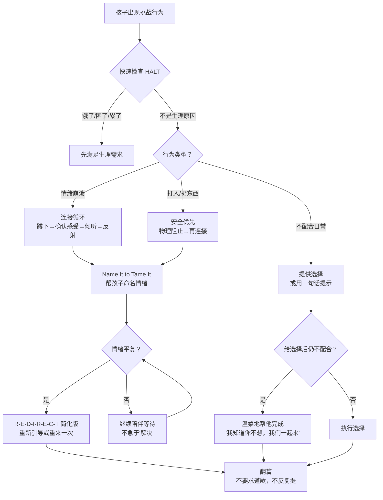

# 《去情绪化管教》&《如何说孩子才会听》深度对比

> 调研日期：2026-05-02
> 数据来源：No-Drama Discipline 原著全文、Refrigerator Sheet、Max Mednik 章节笔记；How to Talk So Kids Will Listen 原著摘要（Readingraphics、SuperSummary、Gottman Institute）、Dr. Haim Ginott 原著理念引用
> 目的：以原始引用为核心，深度展开两本经典管教书的关键策略、适用边界和跨书冲突，为2-3岁幼儿提供循证管教参考

---

## 一、《去情绪化管教》No-Drama Discipline — Daniel Siegel & Tina Payne Bryson

### 核心理念

NDD 是《全脑教养法》（The Whole-Brain Child）的**管教应用版**。WBC 提出"整合大脑"的理论框架，NDD 将其具体落地到日常管教场景中。全书围绕一个核心公式：

> **Connect and Redirect：先连接，再引导。**

管教的本质不是惩罚，而是教导（teaching）。

> "Discipline is meant to be experienced as a gift, not a punishment. The word discipline comes from the Latin word disciplina, which means 'teaching' or 'learning.'" — NDD 原著

### 大脑科学框架

#### 1. 大脑三C原则（Three Brain C's）

> "Your child's brain is: Changing (it's still developing), Changeable (it can grow and be reshaped), Complex (it has many different parts that need to work together)." — NDD 原著

**实际意义**：
- **Changing**：孩子的大脑正在剧烈发育，行为问题往往是"还没发育好"而非"故意捣乱"。2-3岁幼儿的前额叶远未成熟，情绪冲动 > 理性控制是生理常态。
- **Changeable**：神经可塑性意味着每一次互动都在重塑大脑。每一次温和的管教都在强化上脑的神经通路。
- **Complex**：大脑有多个区域需要协同工作。管教的目标是帮孩子整合这些区域（上脑+下脑，左脑+右脑），而非压制某一部分。

#### 2. 上脑 vs 下脑（Upstairs and Downstairs Brain）

> "Imagine that your brain is a house, with an upstairs and a downstairs. The downstairs brain includes the brain stem and the limbic region... it's responsible for basic functions, innate reactions and impulses, and strong emotions. The upstairs brain is made up of the cerebral cortex... it's responsible for higher-order thinking, planning, decision-making, and emotional regulation." — NDD 原著（源自 WBC 框架）

**管教启示**：
- 孩子发飙时 = 下脑（杏仁核）接管，上脑"断线"
- 此时讲道理 = 对一个断线的大脑说话 = 无效
- 必须先**通过连接让上脑重新上线**，再引导

#### 3. "翻盖"概念（Flipping Your Lid）

> "When we 'flip our lids,' our upstairs brain is no longer working well with our downstairs brain. The prefrontal cortex goes offline." — NDD 原著

**对孩子和父母都适用**：
- 孩子翻盖 → 情绪崩溃，无法理性思考
- 父母翻盖 → 吼叫、失控，管教变成伤害
- **管教的前提是双方都没有翻盖**。如果父母已经翻盖，先自己冷静。

#### 4. 三种大脑状态与管教回应

| 大脑状态 | 特征 | 孩子表现 | 管教回应 |
|---------|------|---------|---------|
| **上脑在线** | 理性思考可用 | 能听懂道理、能做选择 | 可以引导、讨论、设定后果 |
| **下脑激活**（tantrum） | 情绪淹没理性 | 哭闹、尖叫、打人 | 先连接安抚，上脑恢复后再引导 |
| **僵住/解离** | 大脑进入保护模式 | 完全封闭、不回应 | 需要安全陪伴，不要强迫互动 |

### "连接+引导"完整框架

#### 连接原则（Connection Principles）

NDD 的连接不是模糊的"温柔"，而是有具体原则的：

**原则一：调低"鲨鱼音乐"（Turn Down Shark Music）**

> "Shark Music" concept: When we hear calming music while watching a nature scene, we feel relaxed. But if the soundtrack switches to the menacing 'Jaws' theme, our whole perception changes — we feel anxious and anticipate danger. Our own internal 'shark music' — our past experiences, fears, and emotional baggage — can distort how we perceive our children's behavior. — NDD 原著（借用了 Circle of Security 的概念）

**实操意义**：当你看到孩子又发脾气时，你脑子里响起的"鲨鱼音乐"可能是"他又来了""他故意气我""我是不是教得不好"。这些内心叙事会让你把一个正常的发展行为看作威胁，从而做出过激反应。

> 父母的第一步不是改变孩子，而是**调低自己的鲨鱼音乐**——提醒自己：这是一个2-3岁的孩子，他的大脑还在发育，这不是对我的挑战。

**原则二：追踪"为什么"（Chase the Why）**

> Instead of asking "How do I get this behavior to stop?", ask "What is my child communicating? What's the reason behind the behavior?" — NDD 核心方法

**实操意义**：孩子不配合吃饭 → 不是"他不听话"，而是"他在告诉我什么？"可能的原因：不饿、想自己吃、注意力被电视吸引、累了。

**原则三：思考"怎么管"（Think About the How）**

> "How you respond to your child's misbehavior matters as much as what you actually do." — NDD 原著

**实操意义**：同样是"不可以扔食物"——
- 吼着说："不可以扔食物！你怎么又来了！"（恐惧+羞辱）
- 平静地说："食物是用来吃的，不是用来扔的。如果你扔，说明你吃完了。"（坚定+尊重）
- 两种方式的内容相同，但"怎么管"完全不同，效果也完全不同。

#### 连接循环（The Connection Cycle）

NDD 给出了连接的四个具体步骤：

**步骤一：传递安慰（Communicate Comfort）**

> "When a child is upset, the first thing to do is communicate comfort. Get down below her eye level. Relax your facial expression. Open your posture. Communicate nonverbally that you are not a threat." — NDD 原著 + Refrigerator Sheet

**实操要点**：
- 蹲下来或坐下来，低于孩子的视线（不是俯视）
- 面部放松，张臂（不是双手叉腰）
- 声音柔和但坚定（不是低吼）
- 物理接触：轻触肩膀、握手、拥抱（如果孩子接受）

**步骤二：确认感受（Validate, Validate, Validate）**

> "Even if you don't agree with your child's perspective, you can still validate her experience. You don't have to agree with the behavior to validate the feeling behind it." — NDD 原著

**关键区分**：
- 确认 ≠ 同意。你可以说"我理解你很生气"而不说"你可以打人"。
- 不确认的后果：孩子感到不被理解 → 更激烈地表达 → 冲突升级

**步骤三：停止说话，倾听（Stop Talking and Listen）**

> "Resist the urge to lecture, explain, or teach in the moment. Just listen." — NDD 原著

**与 Phelan "No Talking" 的呼应**：虽然 NDD 来自完全不同的理论根基（神经科学 vs 行为主义），但在"管教当下不要长篇说教"这一点上，Siegel 和 Phelan 的建议惊人地一致。

**步骤四：反射你所听到的（Reflect What You Hear）**

> "Mirror back what your child is saying so she knows she's been heard." — NDD 原著

**实操示例**：
- 孩子："不要！不要洗澡！"
- 父母（反射）："你不想洗澡。你现在玩得正开心，不想停下来。"
- （而不是："不洗澡怎么行，身上都脏了"——这是否定，不是反射）

#### 引导策略（R-E-D-I-R-E-C-T）

连接完成后，NDD 提供了一个口诀式的引导框架：

**R — Redirect（重新引导）**

> When behavior needs to change, redirect to a more appropriate expression of the same impulse. — NDD 原著

示例：孩子扔积木 → "积木不是用来扔的。来，我们看看积木能不能搭高。"（重新引导冲动到适当行为）

**E —Explain（解释）**

> Help the child understand why the behavior is not acceptable. But do this AFTER connecting, not during the emotional storm. — NDD 原著

关键时序：连接 → 平静 → 解释。顺序不能反。

**D — Do over（重来一次）**

> Give the child a chance to practice the right behavior. "Let's try that again." — NDD 原著

示例：孩子大声命令"给我水！" → "你想要水可以怎么说？'妈妈，可以给我水吗？'来，试一次。"

**I — Imagine the impact（想象影响）**

> Help the child consider how her behavior affects others. "How do you think your sister felt when you took her toy?" — NDD 原著

**适用边界**：这一步需要"心理理论"能力，2-3岁孩子基本不具备。暂时不适用，3-4岁后可以开始。

**R — Respond with empathy（用共情回应）**

> Even when disciplining, maintain a tone of empathy and understanding. — NDD 原著

**E —Emphasize the positive（强调积极面）**

> Highlight what the child did right, not just what she did wrong. — NDD 原著

**C — Create a plan（制定计划）**

> Work together to create a plan for next time. "Next time you're angry, what could you do instead of hitting?" — NDD 原著

**适用边界**：2-3岁孩子无法独立"制定计划"。简化版本：父母代为提出简单选项——"下次生气的时候，你可以来抱抱我，或者跺跺脚。"

#### 1-2-3 管教框架

NDD 有自己的"1-2-3"，与 Phelan 的"数到三"完全不同：

> **1 个定义**：管教 = 教导（teaching），不是惩罚。每次管教前问自己三个问题：
> - (1) 为什么孩子会这样做？
> - (2) 此时此刻我想教给他什么？
> - (3) 怎么教最好？

> **2 个原则**：
> - 等你准备好再管教（不要在翻盖状态管教）
> - 一致但不僵化（consistent but not rigid）

> **3 个 Mindsight 成果**：
> - **洞察（Insight）**：理解自己
> - **共情（Empathy）**：理解他人
> - **修复（Repair）**：关系破裂后能修复

### 关键概念详解

#### "命名以安抚"（Name It to Tame It）

> "When a child can put a name to the frightening or overpowering emotions she's experiencing, the left brain kicks in and helps organize and calm the emotional storm from the right brain." — NDD 原著（源自 WBC）

**神经科学原理**：
- 情绪由右脑和边缘系统（杏仁核）产生
- 语言由左脑处理
- 当孩子说出"我很生气"时，左脑被激活 → 开始与右脑对话 → 情绪被"组织"而非"淹没"
- 杏仁核的激活水平显著降低

**适用边界**：
- **不要在极度恐慌时使用**：孩子尖叫、全身发抖时，语言中枢已经关闭。此时需要的是身体安抚（拥抱、深呼吸），不是语言标注。
- **2-3岁的简化版**：孩子可能说不出"我很沮丧"，但可以说"难过"或"不想"。父母帮他把感受转化为简单词语即可。
- **父母也可以对自己使用**：当你快爆发时，对自己说"我现在很沮丧"——这就是给自己的 Name It to Tame It。

#### "发作平息器 vs 发作引爆器"（Tantrum Tamer vs Tantrum Igniter）

NDD 明确列出了哪些父母行为会**扑灭**情绪崩溃，哪些会**点燃**它：

**Tantrum Tamers（平息器）**：
- 蹲下来，低于孩子视线
- 轻声说话
- 承认感受（"我看到你很难过"）
- 提供身体安慰（如果孩子接受）
- 保持自己的平静

**Tantrum Igniters（引爆器）**：
- 俯视孩子，用手指着
- 大声说话或吼叫
- 否定感受（"有什么好哭的"）
- 威胁（"你再哭我就走了"）
- 用逻辑反驳感受（"你刚才还说想回家的"）

#### HALT 检查清单

> "Before reacting to misbehavior, consider whether your child might be HALT: Hungry, Angry, Lonely, or Tired." — NDD 原著

**实操意义**：孩子突然闹脾气 → 先快速检查：是不是该吃东西了？是不是困了？是不是最近没得到足够的陪伴？很多"行为问题"其实是生理需求伪装的。

#### "不能 vs 不愿意"（Can't vs Won't）重框定

> "Much of what looks like misbehavior is actually a child not yet having the skill to handle the situation. It's not that she won't behave — it's that she can't." — NDD 原著

**实操意义**：
- 2-3岁孩子无法在生气时不打人 → 不是他"不愿意控制"，而是他的大脑**还没有这个能力**
- 这不意味着纵容 → 而是意味着管教方式要**匹配发展阶段**：阻止行为+帮孩子发展能力，而非要求孩子做到超出能力的事

### 适用边界

| 维度 | NDD 的立场 |
|------|-----------|
| **适用年龄** | 全年龄段，但2-3岁需要简化。连接循环可用，引导策略中"I"（想象影响）和"C"（制定计划）需等3-4岁后 |
| **安全例外** | 孩子正在伤害自己或他人时，**先物理阻止，再建立连接**。安全永远第一 |
| **当连接不够时** | NDD 承认有些情况连接本身不足以改变行为——此时需要结合清晰的边界和后果 |
| **对不回应的孩子** | 有些孩子在情绪风暴中完全封闭。NDD建议："陪伴等待，不要强迫互动，让孩子知道你在" |
| **"翻盖"的父母** | 如果你已经翻盖了，先自己冷静。NDD的4 Messages of Hope 就是为此准备的 |
| **文化差异** | NDD 基于西方中产家庭研究，对东亚家庭可能需要调整（如"表达感受"在东亚文化中不那么被鼓励） |

### 作者注意事项（Caveats）

#### 1. 父母不需要完美

> "There is no such thing as a perfect parent. We all lose it sometimes." — NDD 原著

Max Mednik 的笔记特别强调：

> "I also liked that the authors were very upfront about the fact that they fail on these principles all the time and that the principles themselves don't always work out with fairytale endings." — Max Mednik 读书笔记

**实际意义**：NDD 不是在要求你成为完美的父母。它是在提供一套框架，让你在**大部分时候**有方向。搞砸的时候，修复就好。

#### 2. 四则希望信息（Four Messages of Hope）

NDD 在结尾给出了四个让父母安心的重要信息：

1. **没有魔杖**：没有任何方法能一次性解决所有问题。育儿是反复练习的过程。
2. **孩子从你的"失败"中也能受益**：当你搞砸后修复关系，孩子学到的是"关系破裂可以修复"——这本身就是极其重要的能力。
3. **永远可以重新连接**：无论刚才发生了什么，你总是可以回到孩子身边，重新建立连接。
4. **永远不晚**：即使你之前一直在用吼叫的方式，今天开始改变也不晚。大脑的神经可塑性意味着改变随时可以发生。

#### 3. 方法失效的情况

- 当父母把"连接"当作"技巧"而非真正的共情时 → 孩子会识破虚假的情感
- 当"连接"后面没有跟"引导"时 → 变成了放任
- 当家庭处于严重压力中（经济困难、婚姻危机）时 → 管教方法的有效性会大打折扣，需要先解决系统性问题

---

## 二、《如何说孩子才会听》How to Talk So Kids Will Listen & Listen So Kids Will Talk — Adele Faber & Elaine Mazlish

### 核心理念

本书基于 Dr. Haim Ginott 的儿童教养哲学。Faber 和 Mazlish 是 Ginott 的学生/工作坊参与者，将他的理念转化为可操作的具体技巧。

> "What people of all ages can use in a moment of distress is not agreement or disagreement; they need someone to recognize what it is they're experiencing." — Faber & Mazlish，原著

> "It is when our words are infused with our real feelings of empathy that they speak directly to a child's heart." — Faber & Mazlish，原著

### 帮助孩子处理感受的四种方法

#### 1. 全神贯注地倾听（Listen with Full Attention）

> "Children will talk about what they want to talk about when they want to talk about it." — Faber & Mazlish，原著

**实操要点**：
- 放下手机，蹲下来，看着孩子
- 用"嗯""哦""是这样"等简短回应，不打断
- 不要急于给建议或解决方案

**对2-3岁幼儿**：这个年龄段的孩子语言能力正在快速发展，已经开始表达感受。当孩子说话时，全神贯注地听比任何技巧都有效。

#### 2. 用语言确认感受（Acknowledge Feelings with Words）

> "Sometimes just having someone understand how much you want something makes reality easier to bear." — Faber & Mazlish，原著

**实操要点**：
- 孩子说"我的饼干碎了！" → 不要说"没关系，再拿一块" → 而是"你的饼干碎了，你很难过。碎掉的饼干真让人失望。"
- 确认的魔力：当孩子感到被理解时，他反而更容易接受现实

**与 NDD "Name It to Tame It" 的关系**：本质上是同一个策略，只是表述不同。Faber/Mazlish 更侧重"确认感受"的人际沟通维度，Siegel 更侧重"命名情绪"的神经科学维度。

#### 3. 给感受命名（Name the Feeling）

> 给情绪贴标签：生气、失望、害怕、嫉妒……能准确命名情绪的孩子，情绪调节能力更强。 — Faber & Mazlish，源自 Ginott 理念

**对2-3岁的实操**：
- 孩子摔倒了哭 → "摔倒了，好疼。你有点害怕。"（帮他把混沌的感受变成具体的词语）
- 孩子不想收玩具 → "你还想继续玩，不想收起来。你很不舍。"（确认+命名）

#### 4. 在幻想中给予现实中无法给予的（Give in Fantasy What You Can't Give in Reality）

> 这一策略源自 Dr. Haim Ginott，Faber/Mazlish 的导师。 — Gottman Institute, SuperSummary

**经典示例**：
- 孩子想要一匹小马 → 不是"不可能，我们住公寓" → 而是"我多希望我们有一个大农场，可以养好多好多马！你想要几匹？"
- 孩子想吃冰淇淋但已经刷了牙 → "我真希望现在家里有十桶冰淇淋，巧克力味、草莓味、工程车味的……"（幻想满足 → 情绪缓解 → 接受现实）

**为什么有效**：
- 孩子闹情绪往往不是因为"得不到"，而是因为"没人理解我有多想得到"
- 幻想满足传递的是"我理解你的渴望"，不是"我要给你"
- 这种理解本身就能让大脑从情绪模式切换到想象模式

**适用边界**：
- 需要真诚的语气——用嘲讽的语气说"好啊，给你买一百匹马"会适得其反
- 不适用于真正的生理需求（孩子饿了不能说"我多希望你有吃不完的蛋糕"→应该给吃的）
- 2-3岁孩子对"幻想"的理解能力有限，但想象力已经开始萌芽，可以尝试

### 激发合作的五种技巧

> "Information is a lot easier to take than accusation." — Faber & Mazlish，原著

> "The attitude behind your words is as important as the words themselves." — Faber & Mazlish，原著

#### 1. 描述你看到的问题（Describe What You See）

- 不要说："你怎么又把牛奶弄洒了！"
- 而是说："牛奶洒在桌子上了。"
- 原理：描述事实不带指责，孩子更容易主动去处理

**对2-3岁幼儿**："水洒在地板上了。"（简洁描述 → 孩子可能自己去拿抹布）

#### 2. 提供信息（Give Information）

- 不要说："别在沙发上跳！"
- 而是说："沙发是用来坐的。跳跃可以在蹦床上做。"
- 原理：信息比命令更容易被接受

**对2-3岁幼儿**："鞋子是穿在脚上的，不是扔的。"（提供正确信息而非禁止）

#### 3. 用一个词表达（Say It with a Word）

- 不要说："我跟你说了多少次了，洗手！快点去洗手！吃饭前要洗手你不知道吗！"
- 而是说："手。"
- 原理：孩子讨厌说教但能接受提示。一个词足够触发行动。

**对2-3岁幼儿**：语言理解能力正在快速发展，这一个策略特别适合。一个词"水"（水洒了）、"鞋"（鞋没穿）、"手"（该洗手了），简洁有效。

#### 4. 描述你的感受（Describe Your Feelings）

- 不要说："你太不听话了！"
- 而是说："我看到地上都是玩具，我担心有人会踩到摔倒。"
- 原理：用"我"开头表达感受，不攻击孩子的人格

**对2-3岁幼儿**："妈妈踩到积木了，好痛。妈妈有点难过。"（简单表达感受，引发同理心）

#### 5. 写便条（Write a Note）

- 对会认字的大孩子有效（"亲爱的宝贝，玩具们想回家了。——妈妈"）
- **2-3岁不适用**（还不认字），但可以用"画画便条"替代：画一个简单的画示意

### 替代惩罚的七种方法

Faber/Mazlish 反对惩罚，提供七种替代方案：

| 方法 | 示例 | 适合2-3岁？ |
|------|------|-----------|
| 1. 指出有帮助的做法 | "积木不是用来扔的。积木可以用来搭高。" | 适合 |
| 2. 表达强烈的不满（不攻击人格） | "我不喜欢你打人。打人让我很生气。" | 适合 |
| 3. 说出你的期望 | "我希望你在生气的时候用语言告诉我，而不是动手。" | 部分适合（可说短句） |
| 4. 示范如何弥补 | "妹妹被打了，她很难过。你可以轻轻摸摸她的手，让她知道你不是故意的。" | 3岁+ |
| 5. 提供选择 | "你现在不想收玩具。你想先收车还是先收积木？" | 非常适合 |
| 6. 采取行动 | 孩子持续扔食物 → 平静地收走餐盘："看来你吃完了。" | 非常适合 |
| 7. 允许自然后果 | 不收玩具 → 玩具被暂时收进柜子一天 | 适合（需提前约定） |

### 描述性赞赏（Descriptive Praise）

> 不要说"你真棒！"——而是描述你看到的具体行为。这一方法源自 Ginott，由 Faber/Mazlish 推广。 — 原著

**原理**：
- 空洞的赞美（"你真棒"）让孩子依赖外部评价，不确定自己到底好在哪里
- 描述性赞赏帮孩子看到自己的具体能力："我看到你自己把鞋子穿好了，而且左右脚都穿对了！"
- 孩子内化这个描述 → 建立内在动机和自信

**两个层次的描述性赞赏**：

层次一（描述行为）：
- "我看到你把所有的积木都放回了箱子里。"

层次二（加一个总结词）：
- "你把积木都收好了。这就是'负责任'。"
- 给行为一个品质标签，帮孩子建立身份认同。

**适用边界**：
- 不在孩子明显失败时做虚假赞美（孩子会觉得你不真诚）
- 不在每次小事上都赞美（过度赞美稀释效果）
- **描述性赞赏的精髓不在于"找到好的来夸"，而在于"真正看见孩子做了什么"**

### 代替"不要"的方法

Faber/Mazlish 建议用正向指令替代"不要"：

| "不要"版本 | 替代版本 |
|-----------|---------|
| "不要跑！" | "请慢慢走。" |
| "不要扔！" | "积木是用来搭的。" |
| "不要大声叫！" | "请用轻轻的声音。" |
| "不要碰！" | "手放背后。" |

**与 Lansbury "YES 环境" 的关系**：两者异曲同工——减少说"不"的频率，用正向语言引导。

### 适用边界

| 维度 | Faber/Mazlish 的立场 |
|------|---------------------|
| **适用年龄** | 原著面向全年龄段，但核心策略（确认感受、描述、提供选择）2-3岁即可使用 |
| **2-3岁需要简化的策略** | 写便条（不适用）、制定计划（太复杂）、复杂的问题解决讨论（3岁+） |
| **当确认感受让情况更糟时** | 有些孩子在情绪极度激动时，任何语言都会被感觉为"被打扰"。此时沉默陪伴优于语言确认 |
| **当孩子不回应时** | Faber/Mazlish 承认：如果孩子完全封闭，不要强迫互动。"有时候你只需要陪在那里" |
| **替代惩罚 ≠ 没有后果** | 原著明确建议用自然后果替代惩罚性后果。"不收玩具 → 玩具被暂时收走"是自然后果，"不收玩具 → 罚站"是惩罚 |
| **文化适配** | 本书1980年首次出版，基于美国中产家庭。东亚家庭可能需要调整"表达感受"的方式 |

### 作者注意事项（Caveats）

#### 1. 不是万能的

> "The process of searching for the answer is as valuable as the answer itself." — Faber & Mazlish，原著

Faber/Mazlish 并不声称他们的方法永远有效。他们认为**尝试理解孩子的过程本身就是有价值的**，即使最终结果不如预期。

#### 2. 父母的感受同样重要

> Faber/Mazlish 的方法不是要求父母压制自己的感受。书中有专门章节讨论如何表达父母的愤怒和不满——用"我-信息"而非"你-攻击"。 — 原著框架

#### 3. 需要反复练习

> 这些技巧需要反复练习才能内化。不是读完书就能做到的。Faber/Mazlish 在工作坊中让父母反复角色扮演，因为**知道 ≠ 做到**。 — 原著框架

---

## 三、跨书对比分析

### 3.1 NDD vs How to Talk

| 维度 | NDD (Siegel & Bryson) | How to Talk (Faber & Mazlish) |
|------|----------------------|-------------------------------|
| **理论根基** | 神经科学（大脑整合） | 人际沟通（Ginott 的儿童心理学） |
| **核心方法** | Connect and Redirect 框架 | 具体沟通技巧（描述、确认、选择等） |
| **管教定义** | 管教 = 教导（teaching） | 管教 = 通过沟通引导行为 |
| **情绪处理** | Name It to Tame It（神经科学解释） | Acknowledge Feelings（人际沟通解释） |
| **惩罚立场** | 反对惩罚，用连接替代 | 反对惩罚，用7种替代方法 |
| **对"不听话"的理解** | 大脑还没发育好（Can't vs Won't） | 沟通方式需要调整 |
| **实操性** | 框架性强（1-2-3管教、R-E-D-I-R-E-C-T） | 技巧性强（每个场景有具体话术） |

**互补关系**：NDD 给你"为什么这样做"的科学依据，How to Talk 给你"具体说什么"的话术。两者天然互补。

### 3.2 NDD & How to Talk vs Phelan（1-2-3 Magic）

| 维度 | NDD + How to Talk | Phelan (1-2-3 Magic) |
|------|-------------------|----------------------|
| **管教时的语言** | 用共情语言帮助孩子理解（NDD 连接循环 + HT 描述/确认） | 数数时不说话（No-Talking rule） |
| **对情绪的态度** | 情绪是教育机会（NDD）；情绪需要被确认（HT） | 区分情绪和行为，情绪问题不管教 |
| **Time-Out** | 反对——NDD 用 Time-In（陪伴式冷静）替代 | 核心工具——但定义为"休息"而非"惩罚" |
| **理论根基** | 神经科学 + 人际沟通 | 行为主义（条件反射） |
| **管教目标** | 整合大脑 + 建立沟通能力 | 快速停止不当行为 |

**实质差异与调和**：
- NDD 的"Stop Talking and Listen"（连接循环步骤三）和 Phelan 的"No-Talking rule"表面相似但本质不同：NDD 是"安静地倾听孩子"，Phelan 是"安静地执行规则"。
- **最佳结合**：在管教的"执行阶段"（孩子正在打人）用 Phelan 的简洁+行动；在"连接阶段"（事后讨论）用 NDD+HT 的共情+描述。

### 3.3 NDD & How to Talk vs Lansbury（No Bad Kids）

| 维度 | NDD + How to Talk | Lansbury (No Bad Kids) |
|------|-------------------|----------------------|
| **确认感受的方式** | 用语言确认和命名（"你很生气"） | Sportscasting（客观描述发生的事） |
| **身体介入** | 传递安慰的身体语言（蹲下、拥抱） | 明确主张物理阻止（握住手、拿走物品） |
| **管教态度** | CEO式但温暖（"我不会让你这样做"） | CEO式平静高效（CEO比喻） |
| **对 Time-Out** | 反对，用 Time-In 替代 | 明确反对 |

**互补关系**：Lansbury 的方法最适合1-3岁幼儿的物理层面（身体介入、YES环境），NDD+HT 提供了更丰富的语言和情感工具。对2-3岁幼儿，两者结合使用效果最好。

### 3.4 "确认感受"的跨书共识

以下四本书都独立提出了类似的"确认感受"策略，但理论解释不同：

| 书籍 | 策略名称 | 理论解释 |
|------|---------|---------|
| NDD | Name It to Tame It | 神经科学：激活左脑平息右脑情绪风暴 |
| How to Talk | Acknowledge Feelings | 人际沟通：被理解让人更容易接受现实 |
| No Bad Kids | Sportscasting | RIE理念：信任孩子的能力，不给评判 |
| Good Inside | Sturdy Leadership | 依恋理论：确认+边界=安全感 |
| 情商培养 (Gottman) | Emotion Coaching | 情绪智力：觉察→认可→命名→设限→解决 |

**结论**：五种不同的理论流派得出了几乎一致的结论——**确认孩子的感受是管教的第一步**。这种跨流派的共识本身就是策略有效性的有力证据。

---

## 四、对2-3岁幼儿的实操建议

### 最适合2-3岁幼儿的 NDD 策略

| 策略 | 具体做法 | 适用场景 |
|------|---------|---------|
| 连接循环 | 蹲下→确认感受→安静倾听→反射 | 孩子发脾气、哭闹时 |
| Name It to Tame It | "你很生气/难过/害怕。" | 孩子情绪波动但未完全失控时 |
| HALT 检查 | 发飙前先检查：饿了？困了？孤独了？ | 孩子突然闹脾气，排查生理原因 |
| R-E-D-I-R-E-C-T（简化版） | 重新引导 + 解释 + 重来一次 | 孩子扔东西、不配合等 |
| Can't vs Won't 重框定 | "他不是不想控制，是还没能力控制" | 父母心态调整 |
| 鲨鱼音乐觉察 | "他不是在挑战我，是大脑还在发育" | 父母快发火时的自我提醒 |

### 最适合2-3岁幼儿的 How to Talk 策略

| 策略 | 具体做法 | 适用场景 |
|------|---------|---------|
| 描述问题 | "水洒在地板上了。" | 孩子弄洒东西、弄乱时 |
| 提供选择 | "你想先穿衣服还是先穿鞋？" | 孩子不配合日常活动时 |
| 一个词 | "手。"（提醒洗手） | 需要简短提示时 |
| 幻想满足 | "我多希望现在有十桶冰淇淋啊！" | 孩子想要不能给的东西时 |
| 描述性赞赏 | "你自己把鞋穿好了，而且左右都穿对了！" | 孩子做到值得肯定的事时 |
| 自然后果 | 不吃→收走餐盘"看来你吃完了" | 孩子扔食物、不吃饭时 |

### 管教流程（NDD+HT 融合版，2-3岁）

### 年龄演进建议

| 年龄 | NDD 重点 | How to Talk 重点 | 融合方式 |
|------|---------|-----------------|---------|
| 24-30 个月 | 连接循环 + HALT + Name It to Tame It | 描述问题 + 提供选择 + 一个词 + 幻想满足 | NDD 为主框架，HT 提供具体话术 |
| 30-36 个月 | 加入 R-E-D-I-R-E-C-T 解释和"重来一次" | 加入描述性赞赏 + 自然后果 | 两套方法并列使用 |
| 3-4 岁 | 加入"想象影响"和"制定计划" | 加入更复杂的问题解决讨论 | 可以开始教孩子自己使用这些策略 |
| 4 岁+ | 完整的 Connect and Redirect 框架 | 加入写便条、共同制定规则 | 孩子开始有意识地使用语言管理情绪 |

---

## 五、参考来源

1. Siegel, D. J., & Bryson, T. P. (2016). *No-Drama Discipline: The Whole-Brain Way to Calm the Chaos and Nurture Your Child's Developing Mind*. 原著全文。
2. NDD Refrigerator Sheet — The Whole-Brain Way to Calm the Chaos. Principled Living 摘要。
3. Max Mednik, "No-Drama Discipline by Daniel J. Siegel and Tina Payne Bryson" — 章节笔记，maxmednik.com
4. Faber, A., & Mazlish, E. (2012 edition). *How to Talk So Kids Will Listen & Listen So Kids Will Talk*. 原著摘要。
5. Readingraphics, "How to Talk So Kids Will Listen & Listen So Kids Will Talk — Summary and Review" — readingraphics.com
6. SuperSummary, "How to Talk So Kids Will Listen Study Guide" — supersummary.com
7. The Gottman Institute, "Dr. Adele Faber on 'How to Talk So Kids Will Listen'" — gottman.com
8. Ginott, H. G. (1965). *Between Parent and Child* — Faber/Mazlish 方法的理论源头
